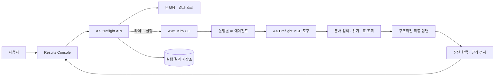

# AX Preflight

**AI Data Readiness Audit · AI 업무 도입 전 점검**

[](https://github.com/syjni/ax-preflight-source/actions/workflows/ci.yml)

AX Preflight는 공개 동결 사례를 바로 탐색하고, 내려받은 로컬 reviewer에서 심사자의
파일·폴더를 정적으로 점검하며, Kiro CLI를 연결한 opt-in live mode에서는 승인된 업무만
모델·전달·예상 비용 통제 아래 반복 실행하는 서비스입니다. 재시작 중단 복구, 로컬 감사
원장 검증·명시적 복구, 원본을 보존하는 단계형 삭제 영수증까지 한 화면에서 확인합니다.

[공개 데모](https://syjni.github.io/ax-preflight-source/) ·
[심사용 Release](https://github.com/syjni/ax-preflight-source/releases/tag/v0.5.0-submission) ·
[심사자 빠른 시작](docs/REVIEWER_QUICKSTART.md) ·
[심사·제출 가이드](SUBMISSION.md) ·
[소스 저장소](https://github.com/syjni/ax-preflight-source)

## 핵심 결과

**정적 Data Readiness는 100점이었지만, AI는 반품 기간 업무에 3회 모두 답하지
못했습니다. 14일과 30일로 충돌하던 문서를 정리하자 같은 업무에 3회 모두
`30일`이라고 답했고, 기존 충돌은 다시 나타나지 않았습니다.**

| 검증 단계 | 정적 Readiness | 반품 기간 업무 | 관측 결과 |
|---|---:|---:|---|
| Before | 100 / 100 | 0 / 3 답변 | 14일·30일 정책 충돌로 3회 모두 보류 |
| After | 100 / 100 | 3 / 3 답변 | 3회 모두 30일, 인용 근거와 답이 직접 일치 |


이 결과는 같은 반품 업무를 상태별로 세 번 실행한 검증 snapshot입니다. AX Preflight는
정적 파일 상태와 실제 업무 수행 결과를 함께 보며, 수정 대상과 재검증 결과를 하나의
흐름으로 연결합니다. 전체 10개 업무의 반복 결과와 해석 기준은
[반복 실행 결과](docs/PHASE6_V4.md)에 공개합니다.

## 무엇을 진단하나

AX·AI 도입 책임자는 준비된 업무와 보완할 업무를 구분하고, 현업·데이터 담당자는
수정할 문서와 검색 경로를 찾으며, 개발팀은 실행별 도구 호출과 근거 연결을 추적할
수 있습니다.

| 진단 영역 | 화면에서 확인하는 내용 |
|---|---|
| 실행 전 온보딩 | 원본 무결성, 파싱 범위, 검색 가능 자료, 평가 정보 분리, 승인 업무 |
| 업무 수행 가능성 | 업무별 답변·보류 상태와 반복 실행의 안정성 |
| 실패 원인 | 출처 충돌, 근거 부족, 정보 부재, 검색 경로 한계 |
| 근거 추적 | 검색 후보 → 읽은 자료 → 최종 인용으로 이어지는 실행 경로 |
| 개선 효과 | 같은 업무의 Before → After 결과와 기존 문제의 재현 여부 |

주요 기능은 검증된 Before → After 대표 흐름, 원인별 복구 안내, 검색·근거 경로,
고객 데이터 온보딩 검사, 최대 50회의 비동기 반복 실행입니다. 반복 실행은 진행률,
부분 실패, 일시정지·재개·중단과 실패 항목 재시도를 기록합니다.

## 구조와 Kiro 기반 실행



AX Preflight는 **AWS Kiro CLI로 실행별 AI 에이전트를 오케스트레이션**합니다. 각
에이전트는 허용된 MCP 데이터 도구로 자료를 찾고 읽은 뒤 구조화된 최종 답변을
제출합니다. AX Preflight API는 답변, 실행별 근거, 진단 항목과 반복 상태를 저장하고
Results Console에 제공합니다.

현재 라이브 요청의 기본 모델 식별자는 `claude-sonnet-5`입니다. 공개 데모는 검증된
결과를 읽는 모드라서 Kiro와 모델 자격 증명이 필요하지 않습니다. 새로운 데이터로
업무를 실행할 때만 Kiro CLI와 사용 가능한 모델 자격 증명이 필요합니다. 상세 계약과
데이터 흐름은 [아키텍처 문서](docs/ARCHITECTURE.md)에서 확인할 수 있습니다.

## 빠른 실행

권장 실행에는 Docker Desktop만 필요합니다. Python 3.12+와 Node.js 20+를 이미
사용한다면 기존 직접 실행 방식도 선택할 수 있습니다.

### 1. 내 자료로 점검하기

GitHub의 **Code → Download ZIP**으로 소스를 내려받아 `C:\ax-preflight`처럼 짧은
경로에 압축을 풉니다. Docker Desktop을 실행한 뒤 프로젝트 루트의
`start-docker.cmd`를 더블클릭하면 Results Console, 로컬 API, 한국어·영어 OCR을
하나의 컨테이너로 준비하고 브라우저를 엽니다.

```bat
cd /d C:\ax-preflight
start-docker.cmd
```

브라우저가 <http://127.0.0.1:8000/>에서 열리면 다음 순서로 확인합니다.

1. 처음 한 번 **관리자 아이디·비밀번호와 기본 프로젝트**를 만듭니다. 비밀번호는
   12자 이상이며 아이디를 포함할 수 없습니다.
2. 로그인 뒤 현재 프로젝트를 확인하고 **결과 콘솔 → 내 자료 점검**에서
   PDF·DOCX·XLSX·CSV·TXT 파일이나 폴더를
   선택합니다. 파일을 점선 영역에 끌어 놓아도 됩니다.
3. **내 자료 점검 시작**을 눌러 파일 접근성, 표 결측, 중복, 최신성, 개인정보 가능
   패턴, PDF 표와 OCR 결과를 검사합니다.
4. **업무 등록·승인**에서 실제 질문, 책임 역할과 성공 기준을 등록합니다. 프로젝트
   OWNER가 승인하면 해당 업무가 `VERIFIED`로 바뀝니다.
5. **모델 연결·데이터 경계·비용**에서 실행 runner 상태와 최근 24시간 사용량을
   확인합니다. 실제 AI 실행은 라이브 factory에서 OWNER가 모델·실행 한도를 저장하고,
   선택 자료의 분류와 모델 전달 경계를 승인한 뒤 열립니다.
6. 결과의 **먼저 보완할 항목**과 **전체 준비도 보기**에서 파일별 조치와 다섯 점수
   차원, 온보딩 프리플라이트를 확인합니다.
7. **이 점검 기록 제거**를 누르면 단계형 삭제가 점검 보고서와 앱의 로컬 관리 사본을
   제거합니다. 중간 오류에는 operation ID가 있는 부분 삭제 영수증과 재개 버튼을
   표시합니다. 컴퓨터에서 선택했던 원본 파일은 삭제하지 않습니다.
8. **구성원과 권한**에서 계정의 로그인 세션을 종료하거나 프로젝트 권한을 회수하고,
   **보관 항목과 삭제**에서 현재 프로젝트의 관리 데이터를 확인할 수 있습니다. 프로젝트
   OWNER는 정확한 프로젝트명을 입력해 해당 프로젝트의 점검·업무·실행 기록을 단계별로
   지울 수 있으며, 실행 중인 run이나 batch 또는 법적 보존이 있으면 삭제가 차단됩니다.
   각 단계는 재실행 가능하고 중간 실패 시 같은 operation ID로 재개합니다. 완료 뒤에는
   프로젝트·구성원·업무·모델 승인·실행·배치·PoC 판단의 제거를 다시 확인합니다. 원본
   파일은 유지하며, 체인 연속성을 위한 opaque 프로젝트 식별자·최소 감사 tombstone과
   삭제 영수증은 로컬 관리 volume에 남습니다.

브라우저에서 선택한 파일은 인터넷 서비스가 아닌 같은 컴퓨터의 `localhost` Docker
API로 전달되어 앱의 로컬 관리 폴더에 복사됩니다. **폴더 선택은 호스트의 폴더 경로를
컨테이너가 직접 읽는 기능이 아니라 브라우저가 폴더 안 파일을 업로드하는 기능**입니다.
따라서 기본 Docker 화면에는 `C:\...` 같은 서버 경로 입력을 표시하지 않습니다. 원본은
수정하지 않으며, 이 정적 점검은 모델을 호출하지 않습니다. Docker 데이터는
`ax-preflight-data` 로컬 volume에, 직접 실행
데이터는 Git에서 제외된 `artifacts/local_datasets/`에 저장됩니다. 기본 안전 한도는
5,000개 파일·전체 1 GiB·파일당 100 MiB이며
`AX_PRODUCT_LOCAL_SCAN_MAX_FILES`, `AX_PRODUCT_LOCAL_SCAN_MAX_BYTES`,
`AX_PRODUCT_LOCAL_SCAN_MAX_FILE_BYTES`로 조정할 수 있습니다. 이 세 한도는 서버에서
다시 검사합니다.

관리자가 복사 없는 서버 경로 점검을 의도적으로 허용하려면 별도의 읽기 전용 bind
mount와 `AX_ALLOWED_SCAN_ROOTS`를 함께 설정합니다. 이 기능은 일반 심사에는 필요하지
않습니다. 아래 명령에서 화면에 입력할 경로는 호스트 경로가 아니라
`/review-input/...`입니다.

Windows 명령 프롬프트:

```bat
set "AX_REVIEW_INPUT=C:\review-data"
docker compose -f compose.yaml -f compose.path-scan.yaml up --build
```

Windows PowerShell:

```powershell
$env:AX_REVIEW_INPUT = "C:\review-data"
docker compose -f compose.yaml -f compose.path-scan.yaml up --build
```

macOS / Linux:

```bash
AX_REVIEW_INPUT=/absolute/path/to/review-data \
  docker compose -f compose.yaml -f compose.path-scan.yaml up --build
```

직접 API를 실행할 때 여러 허용 루트가 필요하면 `AX_ALLOWED_SCAN_ROOTS`에 운영체제의
경로 구분자(Windows `;`, macOS/Linux `:`)로 나열하거나 JSON 문자열 배열을 사용합니다.
resolve된 실제 경로만 허용되며 `..`, 심볼릭 링크·junction을 통한 이탈, AX Preflight의
상태·run·접근 제어 경로, 다른 프로젝트가 이미 사용하는 원본 경로는 거부됩니다.

로컬·라이브 factory는 로그인, HttpOnly SameSite 세션, CSRF 검사와 프로젝트 역할
`OWNER`·`EDITOR`·`VIEWER`를 적용합니다. 관리자 계정과 프로젝트 구성원은 화면의
**구성원과 권한**에서 관리합니다. 실패한 로그인은 기본 15분 창에서 5회까지 허용하고
그 뒤 기본 15분 동안 제한하며, 관리자는 다른 사용자의 세션을 종료할 수 있습니다.
계정·세션·프로젝트·업무 상태와 보안 감사 기록은 같은 로컬 데이터 루트의
`access_control/`에 남고, 비밀번호·세션·CSRF 원문과 실패한 비밀번호는 저장하지
않습니다. Docker volume을 지우면 이 로그인 상태도 함께 삭제되므로 새 관리자를 다시
 설정해야 합니다.

프로젝트 OWNER는 **감사·보존·관리 데이터 삭제**에서 관리 데이터와 감사 이벤트의 검토 주기,
법적 보존 상태를 기록할 수 있습니다. 감사 이벤트는 단조 sequence, SHA-256 연결 해시와
별도 checkpoint로 중간 수정·말미 삭제를 탐지하며, 외부 키 파일을 설정하면 HMAC도
검증합니다. 키 없는 기본 모드는 OS 관리자에 대한 외부 불변 기준점이나 WORM 저장소가
아님을 화면에 표시합니다. 손상 시 위험한 쓰기는 차단하고 inspect·repair·rotate 절차로
원본을 quarantine한 뒤 새 복구 segment를 엽니다. 이 검토 주기는 자동 삭제 스케줄이
아닙니다. 실제 삭제는 OWNER의 프로젝트명 재입력, 단계별 영속 operation, 서버 사후
검증을 거쳐야 하며 실패하면 영수증에 남은 항목을 표시합니다.

로컬 고객 자료를 선택하면 **PoC 평가·승인**이 정적 준비도, 온보딩, 승인 업무, 성공한
최종 실행, `DIRECT_MATCH`, 열린 진단 신호, 모델 전달 경계와 감사 원장 상태를 함께
보여 줍니다. 평가 모집단은 현재 승인된 업무의 `VERIFIED_BUSINESS_TASK` 실행 중
`DELIVERED` 결과만 포함합니다. 승인 업무마다 성공 표본 3회 이상, 답변 표본 3회 이상과
직접 근거 비율 80% 이상을 요구하며 반려·실패·중단·임시 질문·미승인 업무는 제외 사유와
함께 표시합니다. 현재 실행 용량은 운영 상태로 따로 보이지만 이미 수집한 PoC 판단을
뒤집지는 않습니다. GO·조건부·NO-GO 추천 규칙은 화면에 그대로 노출되며, OWNER 판단은
범위·위험 확인과 메모를 포함해 저장됩니다. 이후 판단 관련 지표나 게이트가 바뀌거나 유효
기간이 끝나면 기존 판단은 자동으로 재검토 상태가 됩니다. 이 보고서는 PoC 의사결정
지원이며 법률·보안 인증 또는 업무 정답률 평가가 아닙니다.

종료할 때는 `stop-docker.cmd`를 실행합니다. 점검 데이터를 함께 지우려면 먼저 화면에서
각 점검 기록을 제거하십시오. `docker compose down --volumes`는 AX Preflight Docker
volume 전체를 삭제하는 별도 명령입니다.

Docker를 사용하지 않는 Windows 환경에서는 기존 실행기도 유지됩니다.

```bat
cd /d C:\ax-preflight
start-local.cmd
```

이 방식은 Python·Node 의존성을 설치하고 <http://127.0.0.1:5173/>을 엽니다. Tesseract와
`kor`, `eng` 언어팩이 없으면 스캔 PDF를 OCR하지 않고 화면에 설치 필요 상태와 다음
행동을 표시합니다. 일반 텍스트 PDF의 표 추출은 OCR 설치 여부와 무관하게 동작합니다.

직접 실행 명령이 필요하면 첫 번째 터미널에서 다음을 실행합니다.

```bat
cd /d C:\ax-preflight
python -m venv .venv
.venv\Scripts\python.exe -m pip install -r requirements.txt
set "AX_PRODUCT_FROZEN_RESULTS_ROOT=artifacts\phase6_product_demo_v4\runs"
.venv\Scripts\python.exe -m uvicorn ax_product.api:create_local_review_app_from_env --factory --host 127.0.0.1 --port 8000
```

두 번째 터미널에서는 다음을 실행합니다.

```bat
cd /d C:\ax-preflight\results_console
npm.cmd ci
npm.cmd run dev -- --port 5173
```

macOS·Linux에서도 `docker compose up --build --detach` 후
<http://127.0.0.1:8000/>을 열 수 있습니다. Python·Node 방식은 같은 의존성을 설치한
뒤 API를 다음처럼 시작하고, 별도 터미널에서
`cd results_console && npm ci && npm run dev -- --port 5173`을 실행합니다.

```bash
AX_PRODUCT_FROZEN_RESULTS_ROOT=artifacts/phase6_product_demo_v4/runs \
  python -m uvicorn ax_product.api:create_local_review_app_from_env \
  --factory --host 127.0.0.1 --port 8000
```

### 2. 검증된 공개 예시 보기

[공개 데모](https://syjni.github.io/ax-preflight-source/)에서 다음 순서로 확인하면 핵심 흐름을
3분 안에 볼 수 있습니다.

1. **소개**에서 정적 점수와 실제 업무 결과의 차이를 확인합니다.
2. **결과 콘솔**의 **검증된 대표 흐름**에서 정리 전 **보류 근거 보기**를 엽니다.
3. 정리 후 **30일 근거 확인**을 열어 답변과 인용 자료를 확인합니다.
4. **검색·근거 경로**에서 검색 후보, 읽은 자료와 최종 인용의 연결을 따라갑니다.
5. **관리자 1페이지**에서 수정 대상과 Before → After 요약을 확인합니다.

공개 예시는 파일 업로드 기능이 없는 정적 페이지입니다. 로컬 소스를 실행하면 같은
예시를 유지하면서 **내 자료 점검**이 활성화됩니다.

### 3. 소스와 검증 결과 재현하기

GitHub의 **Code → Download ZIP**을 사용하거나 저장소를 clone합니다. ZIP에는 `.git`
메타데이터가 없으므로 Git inventory 전용 테스트 2개만 의도적으로 건너뜁니다.

```bash
git clone https://github.com/syjni/ax-preflight-source.git
cd ax-preflight-source
```

가상환경 활성화:

```powershell
# Windows PowerShell
python -m venv .venv
.\.venv\Scripts\Activate.ps1
```

```bash
# macOS · Linux
python3 -m venv .venv
source .venv/bin/activate
```

이후 모든 플랫폼에서 같은 검증 명령을 실행합니다.

```bash
python -m pip install -r requirements-dev.txt
python -m pytest -q
python -m scripts.verify_phase6_demo_v4

cd results_console
npm ci
npm test
npm run typecheck
npm run build:static
```

Windows에서 과거 실행이 만든 `%TEMP%\pytest-of-<사용자>` 폴더의 권한 때문에
`PermissionError: [WinError 5]`가 나타나면, 저장소 안의 새 임시 폴더를 지정해 다시
실행합니다.

```powershell
.\.venv\Scripts\python.exe -m pytest -q --basetemp=.pytest-tmp-manual
```

GitHub Actions의
[Source verification](https://github.com/syjni/ax-preflight-source/actions/workflows/ci.yml)도
같은 백엔드·프런트엔드·검증 snapshot 검사를 깨끗한 Ubuntu 환경에서 실행합니다.

### 4. 내 자료로 실제 AI 업무 실행

Kiro CLI가 `PATH`에 있고 모델 자격 증명이 설정된 환경에서 라이브 API를 시작합니다.

```powershell
# Windows PowerShell
$env:AX_PRODUCT_RUNNER = "kiro"
$env:AX_PRODUCT_RUN_TIMEOUT_SECONDS = "300"
python -m uvicorn ax_product.api:create_app_from_env --factory --host 127.0.0.1 --port 8000
```

```bash
# macOS · Linux
AX_PRODUCT_RUNNER=kiro AX_PRODUCT_RUN_TIMEOUT_SECONDS=300 \
  python -m uvicorn ax_product.api:create_app_from_env \
  --factory --host 127.0.0.1 --port 8000
```

이 라이브 factory에도 **내 자료 점검**이 포함됩니다. Results Console은 위와 같은
명령으로 실행합니다. 로컬 폴더를 점검한 뒤 데이터셋을 선택하면 온보딩 검사가 먼저
실행됩니다. 프로젝트 OWNER가 **모델 연결·데이터 경계·비용**에서 다음 순서로
통제를 확정하면 승인 업무·업무 후보·직접 질문과 반복 실행을 사용할 수 있습니다.

1. Kiro CLI 실행 파일 상태를 확인하고 사용할 모델을 지정합니다. 모델 자격 증명은
   실행 환경에서만 관리하며 AX Preflight 화면이나 상태 파일에 저장하지 않습니다.
2. 최근 24시간 실행 수, 배치당 실행 수, 동시 실행 수와 실행당 예상 비용·예상 비용
   한도를 저장합니다.
3. 선택 자료를 `PUBLIC`·`INTERNAL`·`CONFIDENTIAL`로 분류하고, 도구 출력의 모델
   전달·공급자 정책·민감정보 검토를 확인해 자료와 모델 조합을 승인합니다. 개인정보
   가능 패턴이 발견된 자료는 `PUBLIC`으로 승인할 수 없습니다.
4. 단일·반복 실행 직전에 서버가 같은 정책과 승인, 만료, 자료 리비전, 잔여 실행 수·예상 비용,
   동시 실행 수를 다시 검사합니다. 모델이나 파일 내용·경로·마스킹 결과가 바뀌면 자료 전달
   승인을 다시 받아야 하며, 표시 이름만 바뀐 재점검은 같은 리비전으로 유지됩니다.

구성 형식과 실행 계약은 [제품 기술 문서](ax_product/README.md)에 설명되어 있습니다.

## 현재 범위와 제한사항

- 현재 릴리스는 대회 심사와 단일 회사 사내 PoC를 위한 프로토타입입니다. 로컬·라이브 factory에는 로그인 시도 제한, 세션 종료, 프로젝트 역할·자료·업무 접근 격리, 구성원 권한 회수, 보존 검토 주기·법적 보존, 해시 연결 감사 로그와 검증된 프로젝트 삭제가 구현됐습니다. 프로덕션 적용에는 SSO·MFA·계정 복구, 조직 단위 tenant 격리, 암호화·키 관리, 자동 만료 실행, 중앙 WORM 감사 저장소와 백업 연계 삭제·복구가 추가로 필요합니다.
- 대표 결과는 30개 파일과 10개 업무를 두 상태에서 각 3회 실행한 탐색 snapshot입니다. 핵심 개선 주장은 실제로 수정한 반품 기간 업무의 0/3 → 3/3 변화에 한정합니다.
- 근거와 답의 직접 일치는 인용된 구조화 응답에 답 값이 존재한다는 뜻입니다. 업무 정답률 평가는 별도의 기준 데이터와 검토가 필요합니다.
- 라이브 실행에서는 OWNER가 자료 등급과 전달 경계를 승인해야 하며, 데이터 도구가 반환한 문서 일부와 구조화 값이 승인 모델의 처리 경계로 전달될 수 있습니다. 공급자 계정의 보존·학습·리전 정책은 OWNER가 별도로 확인해야 합니다.
- 반복 실행은 단일 API 프로세스의 영속 큐에서 순차 처리합니다. 프로젝트별 최근 24시간 실행 수·예상 비용, 배치 크기와 동시 실행을 서버에서 제한합니다. 사용량은 프로젝트에 귀속되어 자료를 삭제·재등록해도 24시간 창이 끝날 때까지 유지됩니다. 이 비용은 실제 토큰 청구액이 아닌 OWNER가 정한 예약 추정치이며, 분산 worker의 원자적 quota, 실제 사용량 정산, 자동 backoff·스케줄·알림은 후속 범위입니다.
- 민감정보 탐지는 데이터 준비 상태와 자료 분류 승인을 돕는 보조 신호입니다. 실제 고객 데이터에는 별도의 비식별화, DLP, 공급자 보안 검토가 필요합니다.
- 현재 AWS 통합 범위는 Kiro CLI 기반 실행 오케스트레이션입니다. Amazon Bedrock 직접 연동과 AWS SDK 구성은 포함하지 않습니다.
- 최종 패키지는 Windows 11에서 검증했고 공개 CI는 Ubuntu에서 통과했습니다. macOS와 WSL은 별도로 검증하지 않았습니다.

## 저장소 구조

| 경로 | 역할 |
|---|---|
| `ax_scanner/`, `readiness_score.py` | 문서 scan과 정적 Data Readiness 계산 |
| `ax_mcp/` | 문서·구조화 데이터 조회 도구 |
| `ax_product/` | FastAPI, Kiro runner, 제출 계약, 결과 저장과 진단·근거 검사 |
| `results_console/` | React·TypeScript 기반 Results Console |
| `runtime_datasets.json` | dataset profile과 source·scan 경로 연결 |
| `Dockerfile`, `compose.yaml` | 콘솔·API·한국어/영어 OCR을 묶은 심사자 실행 환경 |
| `start-docker.cmd`, `stop-docker.cmd` | Windows Docker 검토 모드 시작·종료 |
| `start-local.cmd` | Python·Node 기반 Windows 직접 실행 |
| `artifacts/local_datasets/` | 직접 실행의 로컬 registry·마스킹 보고서·브라우저 선택 관리 사본 |
| `artifacts/local_datasets/access_control/` | Argon2id 계정, 해시 세션·로그인 시도, 프로젝트·구성원·업무 승인, 실행 정책·자료 전달 승인·예상 비용 예약과 보안 감사 기록 |
| `artifacts/product_runs/` | 새 실행의 결과와 근거 기록 |
| `artifacts/product_batches/` | 반복 실행의 진행률과 제어 상태 |
| `artifacts/phase6_product_demo_v4/runs/` | 현재 검증된 읽기 전용 snapshot |
| `scripts/`, `tests/` | 재현 검증 스크립트와 자동 테스트 |

과거 snapshot과 검사 규칙의 버전 관계는
[검증 산출물 버전 이력](docs/VERIFICATION_HISTORY.md)에서 분리해 관리합니다.

## 상세 문서

- [심사·제출 가이드](SUBMISSION.md)
- [심사자 빠른 시작](docs/REVIEWER_QUICKSTART.md)
- [시스템 구조와 데이터 흐름](docs/ARCHITECTURE.md)
- [데이터 처리와 개인정보 경계](docs/DATA_AND_PRIVACY.md)
- [3분 시연 대본](docs/DEMO_SCRIPT.md)
- [반복 실행 결과와 해석 범위](docs/PHASE6_V4.md)
- [의미 비교 규칙](docs/PHASE6_V4_COMPARISON_V2.md)
- [검색·근거 경로 감사](docs/PHASE6_V4_ORDER_RETRIEVAL_REVIEW.md)
- [검증 산출물 버전 이력](docs/VERIFICATION_HISTORY.md)

설치·테스트·화면 동작에서 재현되는 문제는
[GitHub Issues](https://github.com/syjni/ax-preflight-source/issues)에 실행 환경, 재현
명령, 기대 결과와 실제 결과를 남겨 주십시오. 고객 문서 원문, 모델 자격 증명과
개인정보는 첨부하지 마십시오.
