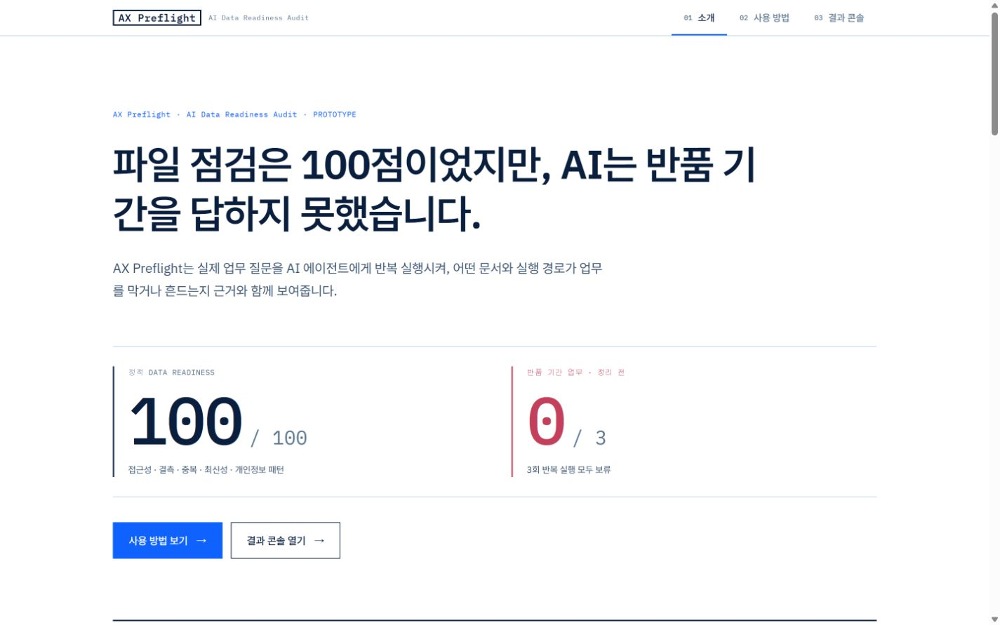
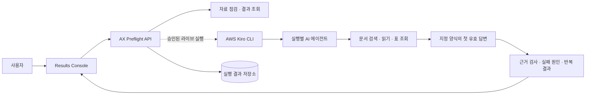

# AX Preflight

**AI Data Readiness Audit · AI 업무 도입 전 점검**

[](https://github.com/syjni/ax-preflight-source/actions/workflows/ci.yml)

**회사 자료가 실제 업무 질문에 근거 있는 답을 반복해서 낼 수 있는지, AI 도입 전에
확인합니다.**

승인된 실제 업무를 Kiro로 반복 실행하고, 답변과 같은 실행에서 나온 직접 근거를
확인해 실패 원인을 **문서
충돌·자료 공백·검색 한계**로 구분합니다. 현업 담당자와 결재권자는 어떤 자료를
고쳐야 하는지, 수정 후 같은 업무가 안정적으로 수행되는지, 어떤 위험이 남았는지를
하나의 흐름에서 판단할 수 있습니다.

[공개 데모](https://syjni.github.io/ax-preflight-source/) ·
[제출 Release](https://github.com/syjni/ax-preflight-source/releases/tag/v0.5.0-submission) ·
[빠른 시작](docs/REVIEWER_QUICKSTART.md) ·
[심사·제출 가이드](SUBMISSION.md) ·
[소스 저장소](https://github.com/syjni/ax-preflight-source)

## 핵심 결과

정적 Data Readiness가 `100 / 100`이어도 AI가 실제 업무에 답할 수 있다는 뜻은
아니었습니다. 반품 기간 업무에서는 14일과 30일 정책이 충돌해 3회 모두 답변을
보류했습니다. 충돌 문서를 정리한 뒤 같은 업무를 다시 실행하자 3회 모두 `30일`로
답했고, 같은 실행에서 답을 직접 확인할 수 있는 근거도 남았습니다.

| 대표 업무 | 정리 전 | 정리 후 | AX Preflight 진단 |
|---|---:|---:|---|
| 반품 가능 기간 | 0 / 3 | 3 / 3 | **문서 충돌** · 14일·30일 충돌 제거 후 30일 직접 근거 확인 |
| 최근 거래처 등록일 | 0 / 3 | 0 / 3 | **자료 공백** · 등록일을 확인할 자료가 없음 |
| 이번 달 주문금액 | 3 / 3 | 2 / 3 | **검색 한계** · 문서 정리와 무관하게 검색어·범위에 따라 원장 노출이 달라짐 |
| 등록된 거래처 수 | 3 / 3 | 3 / 3 | **반복 안정** · 세 번 모두 같은 값과 직접 근거 확인 |

`n / 3`은 답 값이 같은 실행의 인용 근거에서 직접 확인된 횟수이며 정답률이 아닙니다.
검증 결과는 10개 업무를 정리 전후에 각각 3회, 총 60회 새 Kiro 실행으로 관측한
탐색 결과입니다. 실제로 문서를 수정해 개선 효과를 주장하는 범위는 반품 기간 업무의
`0 / 3 → 3 / 3` 변화입니다.



전체 10개 업무의 반복 결과와 해석 기준은
[반복 실행 결과](docs/PHASE6_V4.md)에서 확인할 수 있습니다.

## 공개 데모에서 3분 안에 보기

[공개 데모](https://syjni.github.io/ax-preflight-source/)는 설치나 로그인 없이 검증된
대표 흐름을 보여 줍니다.

1. **소개**에서 정적 점수 `100`과 실제 반품 업무 `0 / 3`의 차이를 확인합니다.
2. **결과 콘솔 → 검증된 대표 흐름**에서 정리 전 **보류 근거 보기**를 엽니다.
3. 정리 후 **30일 근거 확인**에서 답변과 인용 자료가 직접 연결되는지 확인합니다.
4. **검색·근거 경로**에서 검색 후보, 읽은 자료와 최종 인용을 따라갑니다.
5. **PoC 평가·승인**과 **관리자 1페이지**에서 승인 기준, 수정 대상과 남은 위험을
   확인합니다.

공개 데모는 검증 결과를 읽는 정적 페이지입니다. 사용자 파일 점검과 새로운 Kiro
실행은 내려받은 로컬 패키지에서 명시적으로 활성화합니다.

## 실행 경로

| 실행 경로 | 준비물 | 할 수 있는 일 | 의도적으로 제한된 기능 |
|---|---|---|---|
| [공개 데모](https://syjni.github.io/ax-preflight-source/) | 웹 브라우저 | 동결된 60회 결과, 대표 Before → After, 검색·근거 경로, PoC 평가와 관리자 보고서 확인 | 파일 업로드와 새로운 AI 실행 |
| 로컬 reviewer | Docker Desktop, [검증된 릴리스 ZIP](https://github.com/syjni/ax-preflight-source/releases/tag/v0.5.0-submission) | 자신의 PDF·DOCX·XLSX·CSV·TXT를 넣어 정적 준비도와 파일별 보완 항목 확인, 공개 예시 탐색 | 기본 실행에서는 외부 모델 호출과 새로운 AI 답변 생성 |
| Kiro live mode | Python 3.12+, Node.js 20+, Kiro CLI와 모델 자격 증명 | 자신의 자료로 질문을 등록·승인하고 단일 또는 반복 실행, 답변·보류·근거 경로와 개선 결과 확인 | 승인되지 않은 자료·업무·모델 조합의 실행 |

## 무엇을 할 수 있나

| 기능 | 입력과 동작 | 결과 |
|---|---|---|
| 자료 점검 | PDF·DOCX·XLSX·CSV·TXT 파일 또는 폴더 선택 | 파일에 접근할 수 있고 표·문서가 검색 가능한지, 결측·중복·최신성·민감정보 신호가 무엇인지 확인 |
| 업무 정의 | 일반 업무 후보 10개에서 선택하거나 질문·담당 역할·성공 기준 직접 등록 | 프로젝트 책임자가 승인한 실제 업무 목록 |
| 반복 검증 | 승인된 업무를 같은 조건으로 여러 번 실행 | 업무별 답변·보류 횟수와 반복 안정성, 실행별 상태와 실패 재시도 확인 |
| 근거 검사 | 최종 답변이 인용한 같은 실행의 검색·읽기·표 조회 결과 검사 | 답 값의 직접 근거 여부와 검색 후보 → 읽은 자료 → 최종 인용의 연결 확인 |
| 실패 원인 분류 | 반복 답변, 보류 설명과 근거 경로 비교 | 문서 충돌, 자료 공백, 검색 한계와 다음 검토 지점 확인 |
| 수정 효과 확인 | 같은 업무의 정리 전·후 결과 비교 | 기존 문제가 다시 나타나는지와 답변·보류·근거 결과가 어떻게 달라졌는지 확인 |
| PoC 판단 | 준비도, 승인 업무, 성공 표본, 직접 근거와 열린 위험 집계 | 개별 게이트의 통과·검토·차단과 책임자의 진행·조건부 진행·보류 판단을 관리자 보고서로 정리 |
| 운영 통제 | 프로젝트 권한, 모델·자료 전달 승인, 실행·예상 비용 한도 | 승인 범위 안의 실행과 감사 가능한 변경 기록 |

제품은 일반 업무 질문 후보 10개를 제공합니다. 사용자는 후보를 선택하거나 직접 질문을
등록하고, 프로젝트 책임자는 질문·담당 역할·성공 기준을 확인한 뒤 실행을 승인합니다.
기본 후보는 회사별로 검증된 업무가 아니므로 실제 자료에 적용할 수 있는지는 사용자가
판단합니다.

기본 PoC 검토 기준은 승인 업무별 성공 실행 3회 이상, 답변 표본 3회 이상, 같은 실행의
직접 근거 비율 80% 이상입니다. 이 기준은 의사결정을 돕는 제품 게이트이며 업무 정답률이나
보안 인증을 뜻하지 않습니다. 화면은 개별 게이트를 `PASS/WARN/BLOCK`으로 계산하고,
이를 종합한 추천과 남은 위험을 바탕으로 책임자가 **진행·조건부 진행·보류**를 판단합니다.

## 작동 방식



AX Preflight는 AWS Kiro CLI로 실행마다 새 AI 에이전트를 시작합니다. 에이전트는 허용된
데이터 도구로 자료를 찾고 읽은 뒤 지정된 양식으로 답을 제출합니다. 제품은 첫 번째 유효한
답만 기록하고, 그 답이 인용한 같은 실행의 구조화 응답을 별도로 검사합니다. 자유형 최종
문장은 제품 결과로 인정하지 않습니다.

현재 라이브 요청의 기본 모델 식별자는 `claude-sonnet-5`입니다. 공개 데모에는 Kiro나
모델 자격 증명이 필요하지 않습니다. 라이브 실행에서는 승인된 문서 일부와 구조화 값이
설정된 모델 처리 경계로 전달될 수 있습니다. 프로젝트 책임자가 자료 등급, 모델 전달 범위,
공급자 정책과 실행·예상 비용 한도를 먼저 승인해야 합니다.

반복 요청은 비동기로 접수합니다. 현재 구현은 단일 API 프로세스의 영속 큐에서 최대 50개
실행을 순차 처리하며 진행률, 부분 실패, 일시정지·재개·중단과 실패 항목 재시도를 기록합니다.
세부 계약과 데이터 흐름은 [아키텍처 문서](docs/ARCHITECTURE.md)에 설명되어 있습니다.

## 로컬에서 내 자료 점검하기

### 1. 검증된 패키지 받기

Windows 검토 환경에서는 Docker Desktop 방식이 가장 짧습니다. 제출 고정본인
[`ax-preflight-v0.5.0-submission.zip`](https://github.com/syjni/ax-preflight-source/releases/download/v0.5.0-submission/ax-preflight-v0.5.0-submission.zip)을
내려받아 `C:\ax-preflight`처럼 짧은 경로에 압축을 풉니다. 이 파일은
[`v0.5.0-submission` 릴리스](https://github.com/syjni/ax-preflight-source/releases/tag/v0.5.0-submission)에
첨부된 검증 패키지입니다.

저장소를 직접 clone해도 같은 소스를 받을 수 있습니다.

```bash
git clone https://github.com/syjni/ax-preflight-source.git
cd ax-preflight-source
```

### 2. Docker reviewer 시작하기

Docker Desktop을 먼저 실행합니다. Windows에서는 압축을 푼 폴더의
`start-docker.cmd`를 더블클릭하거나 명령 프롬프트에서 실행합니다.

```bat
cd /d C:\ax-preflight
start-docker.cmd
```

스크립트는 Docker 상태를 확인하고, 콘솔·API·한국어/영어 OCR을 포함한 이미지를 만든 뒤
서비스 준비 상태를 기다립니다. 첫 실행은 이미지를 내려받고 빌드하므로 인터넷 연결과 몇
분의 시간이 필요할 수 있습니다. 준비가 끝나면 <http://127.0.0.1:8000/>이 자동으로
열립니다.

macOS·Linux에서는 프로젝트 루트에서 Docker Compose를 실행한 뒤 같은 주소를 엽니다.

```bash
docker compose up --build --detach
```

### 3. 처음 로그인하기

첫 화면에서 로컬 관리자 계정과 기본 프로젝트를 만듭니다. 아이디는 3자 이상, 비밀번호는
12자 이상이어야 하며 비밀번호에 아이디를 포함할 수 없습니다. 계정과 프로젝트는 이
컴퓨터의 Docker volume에만 생성됩니다.

### 4. 번들 예시 확인하기

첫 화면의 **검증된 예시 보기**를 누르면 위의
[공개 데모 3분 동선](#공개-데모에서-3분-안에-보기)과 같은 결과를 로컬에서도 확인할
수 있습니다.

### 5. 내 자료로 정적 점검하기

로그인한 뒤 **결과 콘솔 → 내 자료 점검**에서 다음 순서로 진행합니다.

1. **파일 선택**, **폴더 선택** 또는 끌어 놓기로 PDF·DOCX·XLSX·CSV·TXT를 추가합니다.
2. 선택 목록을 확인하고 **내 자료 점검 시작**을 누릅니다.
3. 준비도 점수, 파싱된 파일·표·OCR 처리 수와 **먼저 보완할 항목**을 확인합니다.
4. 항목을 펼쳐 관련 파일, 관측 내용과 권고 조치를 확인하고 **전체 준비도 보기**에서
   중복·완결성·권한·접근성·최신성 세부 점수를 확인합니다.
5. **업무 등록·승인**에서 실제 질문·담당 역할·성공 기준을 등록하고 승인합니다.
6. **모델 연결·데이터 경계·비용**에서 라이브 실행에 필요한 승인과 현재 차단 이유를
   확인합니다.

기본 reviewer는 여기까지 모델 없이 동작합니다. 자신의 파일에 대한 새로운 AI 답변과
반복 실행 결과가 필요하면 아래의 Kiro live mode로 API를 다시 시작해야 합니다. 화면에서
버튼 하나로 외부 모델이 켜지지는 않습니다.

브라우저에서 선택한 파일은 같은 컴퓨터의 localhost API로 전달되어 앱의 로컬 관리
폴더에 복사됩니다. 원본 파일은 수정하지 않고, 정적 점검 단계에서는 모델을 호출하지
않습니다. 기본 한도는 5,000개 파일, 전체 1 GiB, 파일당 100 MiB입니다. 로그인·프로젝트
권한·감사 기록·검증된 관리 데이터 삭제를 지원합니다.

### 6. 종료와 빠른 문제 해결

Windows에서는 `stop-docker.cmd`, macOS·Linux에서는 `docker compose down`으로
종료합니다. Docker volume을 명시적으로 삭제하지 않는 한 계정과 점검 기록은 다음 실행에
유지됩니다.

- Docker 오류가 나면 Docker Desktop이 실행 중인지 확인합니다.
- 화면이 열리지 않으면 <http://127.0.0.1:8000/>을 직접 열고
  `docker compose logs ax-preflight`로 로그를 확인합니다.
- 포트 8000이 이미 사용 중이면 이전 AX Preflight 또는 다른 로컬 서버를 종료합니다.
- 공개 데모에서는 파일 선택이 비활성화됩니다. 파일 점검에는 내려받은 로컬 reviewer가
  필요합니다.
- Docker를 사용할 수 없는 Windows에서는 Python 3.12+와 Node.js 20+를 설치하고
  `start-local.cmd`를 실행할 수 있습니다. 이 경로의 OCR에는 별도 Tesseract 언어팩이
  필요할 수 있습니다.

서버 경로 점검, 읽기 전용 bind mount, 직접 Python·Node 실행, OCR 설치와 종료 방법은
[빠른 시작](docs/REVIEWER_QUICKSTART.md)에 정리되어 있습니다. 파일 저장 위치,
모델 전달 경계, 보존·법적 보존, 감사 원장과 단계형 삭제의 구현 세부사항은
[데이터 처리와 개인정보 경계](docs/DATA_AND_PRIVACY.md)에서 확인할 수 있습니다.

## Kiro로 실제 업무 실행하기

Kiro live mode는 **새 질문을 실제 AI 에이전트로 실행하려는 심사 환경**을 위한 선택
경로입니다. Kiro CLI가 `PATH`에 있고 사용할 모델 자격 증명이 설정되어 있어야 합니다.
Docker reviewer가 실행 중이면 먼저 종료해 포트 8000을 비웁니다. 프로젝트 루트에서
Python 환경과 제품 의존성을 준비한 뒤 라이브 API를 시작합니다.

Windows PowerShell:

```powershell
python -m venv .venv
.\.venv\Scripts\python.exe -m pip install -r requirements.txt
$env:AX_PRODUCT_RUNNER = "kiro"
$env:AX_PRODUCT_RUN_TIMEOUT_SECONDS = "300"
.\.venv\Scripts\python.exe -m uvicorn ax_product.api:create_app_from_env --factory --host 127.0.0.1 --port 8000
```

macOS·Linux:

```bash
python3 -m venv .venv
./.venv/bin/python -m pip install -r requirements.txt
AX_PRODUCT_RUNNER=kiro AX_PRODUCT_RUN_TIMEOUT_SECONDS=300 \
  ./.venv/bin/python -m uvicorn ax_product.api:create_app_from_env \
  --factory --host 127.0.0.1 --port 8000
```

API 터미널을 열어 둔 채 두 번째 터미널에서 Results Console을 시작합니다.

```bash
cd results_console
npm ci
npm run dev -- --port 5173
```

브라우저에서 <http://127.0.0.1:5173/>을 열고 로컬 reviewer와 같은 계정·프로젝트·자료
등록 과정을 진행합니다. 라이브 실행 전 프로젝트 책임자는 다음을 확정합니다.

1. 사용할 모델과 Kiro CLI 실행 상태
2. 24시간 실행 수, 배치당 실행 수, 동시 실행 수와 예상 비용 한도
3. 자료 등급과 모델 전달 범위, 공급자 정책과 민감정보 검토
4. 실행할 업무 질문·담당 역할·성공 기준

승인이 끝나면 **조회와 실행**에서 단일 질문을 실행하거나 **반복 실행
오케스트레이션**에서 여러 승인 업무를 최대 50개 실행 단위로 요청할 수 있습니다.
요청 후에는 진행률과 답변·보류 상태를 확인하고, **진단 결과**와 **검색·근거 경로**에서
실패 원인과 같은 실행의 직접 근거를 검토합니다. 자료를 수정했다면 같은 질문을 다시
실행해 정리 전·후 결과를 비교합니다.

모델, 파일 내용·경로 또는 마스킹 결과가 바뀌면 자료 전달 승인을 다시 받아야 합니다.
모델 자격 증명은 실행 환경에서 관리하며 제품 화면이나 상태 파일에 저장하지 않습니다.
구성 형식과 실행 계약은 [제품 기술 문서](ax_product/README.md)에 설명되어 있습니다.

## 검증 재현하기

```bash
python -m pip install -r requirements-dev.txt
python -m pytest -q
python -m scripts.verify_phase6_demo_v4

cd results_console
npm ci
npm test
npm run typecheck
npm run build:static
```

GitHub Actions의
[Source verification](https://github.com/syjni/ax-preflight-source/actions/workflows/ci.yml)도
백엔드·프런트엔드·동결 결과 검증을 깨끗한 Ubuntu 환경에서 실행합니다. 다운로드 ZIP에는
`.git` 메타데이터가 없으므로 Git inventory 전용 테스트 2개만 의도적으로 건너뜁니다.

## 현재 범위와 제한사항

- 현재 릴리스는 대회 심사와 단일 회사 사내 PoC를 위한 프로토타입입니다. 로그인 시도
  제한, 세션 종료, 프로젝트 역할·자료·승인 업무 접근 통제, 감사 기록과 명시적 삭제를
  구현했습니다. 프로덕션에는 SSO·MFA, 계정 복구, 조직 단위 데이터 격리, 암호화·키 관리,
  중앙 감사 저장소와 백업 연계 삭제·복구가 더 필요합니다.
- 대표 결과는 합성 회사 자료 30개와 10개 업무를 정리 전후 각각 3회 실행한 60회 탐색
  결과입니다. 개선 주장은 실제로 수정한 반품 기간 업무의 `0 / 3 → 3 / 3`에 한정합니다.
- 직접 근거 일치는 답 값이 인용된 같은 실행의 구조화 응답에서 확인됐다는 뜻입니다.
  업무 정답률을 평가하려면 별도의 기준 데이터와 현업 검토가 필요합니다.
- 라이브 실행에서는 승인된 문서 일부와 구조화 값이 모델 처리 경계로 전달될 수 있습니다.
  공급자 계정의 보존·학습·리전 정책은 프로젝트 책임자가 별도로 확인해야 합니다.
- 실행 요청은 비동기로 받지만 현재 단일 프로세스의 영속 큐가 작업을 순차 처리합니다.
  비용 값은 프로젝트 책임자가 설정한 예약 추정치이며 실제 토큰 청구액 측정은 후속
  범위입니다.
- 현재 AWS 통합 범위는 Kiro CLI 기반 실행 오케스트레이션입니다. Bedrock 직접 연동과
  AWS SDK 구성은 다음 파일럿의 검증 항목입니다.
- 최종 패키지는 Windows 11에서 검증했고 공개 CI는 Ubuntu에서 통과했습니다. macOS와
  WSL은 별도 검증 대상입니다.

## 저장소 구조

| 경로 | 역할 |
|---|---|
| `ax_scanner/`, `readiness_score.py` | 문서 점검과 정적 Data Readiness 계산 |
| `ax_mcp/` | 문서 검색·읽기·구조화 데이터 조회 도구 |
| `ax_product/` | FastAPI, Kiro 실행, 결과 저장, 진단·근거 검사와 승인 통제 |
| `results_console/` | React·TypeScript 기반 결과 화면과 공개 데모 |
| `runtime_datasets.json` | 데이터셋 프로필과 자료·점검 경로 연결 |
| `Dockerfile`, `compose.yaml` | 콘솔·API·한국어/영어 OCR을 묶은 로컬 실행 환경 |
| `artifacts/phase6_product_demo_v4/runs/` | 검증된 읽기 전용 결과 |
| `scripts/`, `tests/` | 재현 검증 스크립트와 자동 테스트 |

## 상세 문서

- [심사·제출 가이드](SUBMISSION.md)
- [빠른 시작](docs/REVIEWER_QUICKSTART.md)
- [시스템 구조와 데이터 흐름](docs/ARCHITECTURE.md)
- [데이터 처리와 개인정보 경계](docs/DATA_AND_PRIVACY.md)
- [3분 시연 대본](docs/DEMO_SCRIPT.md)
- [반복 실행 결과와 해석 범위](docs/PHASE6_V4.md)
- [의미 비교 규칙](docs/PHASE6_V4_COMPARISON_V2.md)
- [검색·근거 경로 감사](docs/PHASE6_V4_ORDER_RETRIEVAL_REVIEW.md)
- [검증 산출물 버전 이력](docs/VERIFICATION_HISTORY.md)

설치·테스트·화면 동작에서 재현되는 문제는
[GitHub Issues](https://github.com/syjni/ax-preflight-source/issues)에 실행 환경, 재현 명령,
기대 결과와 실제 결과를 남겨 주십시오. 고객 문서 원문, 모델 자격 증명과 개인정보는
첨부하지 마십시오.
