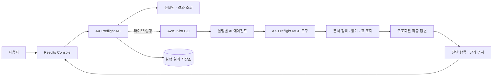

# AX Preflight

**AI Data Readiness Audit · AI 업무 도입 전 점검**

[](https://github.com/syjni/ax-preflight-source/actions/workflows/ci.yml)

AX Preflight는 실제 AI 업무를 반복 실행해 **어떤 데이터와 검색 경로가 업무를
막거나 흔드는지** 찾고, 수정 전후의 변화를 근거와 함께 보여주는 서비스입니다.

[공개 데모](https://syjni.github.io/ax-preflight/) ·
[검증된 Release](https://github.com/syjni/ax-preflight-source/releases/tag/v0.1.0-submission) ·
[심사·제출 가이드](SUBMISSION.md) ·
[소스 저장소](https://github.com/syjni/ax-preflight-source)

## 핵심 결과

**정적 Data Readiness는 100점이었지만, AI는 반품 기간 업무에 3회 모두 답하지
못했습니다. 14일과 30일로 충돌하던 문서를 정리하자 같은 업무에 3회 모두
`30일`이라고 답했고, 기존 충돌은 다시 나타나지 않았습니다.**

| 검증 단계 | 정적 Readiness | 반품 기간 업무 | 관측 결과 |
|---|---:|---:|---|
| Before | 100 / 100 | 0 / 3 답변 | 14일·30일 정책 충돌로 3회 모두 보류 |
| After | 100 / 100 | 3 / 3 답변 | 3회 모두 30일, 인용 근거와 답이 직접 일치 |


이 결과는 같은 반품 업무를 상태별로 세 번 실행한 검증 snapshot입니다. AX Preflight는
정적 파일 상태와 실제 업무 수행 결과를 함께 보며, 수정 대상과 재검증 결과를 하나의
흐름으로 연결합니다. 전체 10개 업무의 반복 결과와 해석 기준은
[반복 실행 결과](docs/PHASE6_V4.md)에 공개합니다.

## 무엇을 진단하나

AX·AI 도입 책임자는 준비된 업무와 보완할 업무를 구분하고, 현업·데이터 담당자는
수정할 문서와 검색 경로를 찾으며, 개발팀은 실행별 도구 호출과 근거 연결을 추적할
수 있습니다.

| 진단 영역 | 화면에서 확인하는 내용 |
|---|---|
| 실행 전 온보딩 | 원본 무결성, 파싱 범위, 검색 가능 자료, 평가 정보 분리, 승인 업무 |
| 업무 수행 가능성 | 업무별 답변·보류 상태와 반복 실행의 안정성 |
| 실패 원인 | 출처 충돌, 근거 부족, 정보 부재, 검색 경로 한계 |
| 근거 추적 | 검색 후보 → 읽은 자료 → 최종 인용으로 이어지는 실행 경로 |
| 개선 효과 | 같은 업무의 Before → After 결과와 기존 문제의 재현 여부 |

주요 기능은 검증된 Before → After 대표 흐름, 원인별 복구 안내, 검색·근거 경로,
고객 데이터 온보딩 검사, 최대 50회의 비동기 반복 실행입니다. 반복 실행은 진행률,
부분 실패, 일시정지·재개·중단과 실패 항목 재시도를 기록합니다.

## 구조와 Kiro 기반 실행



AX Preflight는 **AWS Kiro CLI로 실행별 AI 에이전트를 오케스트레이션**합니다. 각
에이전트는 허용된 MCP 데이터 도구로 자료를 찾고 읽은 뒤 구조화된 최종 답변을
제출합니다. AX Preflight API는 답변, 실행별 근거, 진단 항목과 반복 상태를 저장하고
Results Console에 제공합니다.

현재 라이브 요청의 기본 모델 식별자는 `claude-sonnet-5`입니다. 공개 데모는 검증된
결과를 읽는 모드라서 Kiro와 모델 자격 증명이 필요하지 않습니다. 새로운 데이터로
업무를 실행할 때만 Kiro CLI와 사용 가능한 모델 자격 증명이 필요합니다. 상세 계약과
데이터 흐름은 [아키텍처 문서](docs/ARCHITECTURE.md)에서 확인할 수 있습니다.

## 빠른 실행

필요 환경은 Python 3.12+와 Node.js 20+입니다.

### 1. 공개 데모 보기

[공개 데모](https://syjni.github.io/ax-preflight/)에서 다음 순서로 확인하면 핵심 흐름을
3분 안에 볼 수 있습니다.

1. **소개**에서 정적 점수와 실제 업무 결과의 차이를 확인합니다.
2. **결과 콘솔**의 **검증된 대표 흐름**에서 정리 전 **보류 근거 보기**를 엽니다.
3. 정리 후 **30일 근거 확인**을 열어 답변과 인용 자료를 확인합니다.
4. **검색·근거 경로**에서 검색 후보, 읽은 자료와 최종 인용의 연결을 따라갑니다.
5. **관리자 1페이지**에서 수정 대상과 Before → After 요약을 확인합니다.

### 2. 소스 내려받아 검증하기

GitHub의 **Code → Download ZIP**을 사용하거나 저장소를 clone합니다. ZIP에는 `.git`
메타데이터가 없으므로 Git inventory 전용 테스트 2개만 의도적으로 건너뜁니다.

```bash
git clone https://github.com/syjni/ax-preflight-source.git
cd ax-preflight-source
```

가상환경 활성화:

```powershell
# Windows PowerShell
python -m venv .venv
.\.venv\Scripts\Activate.ps1
```

```bash
# macOS · Linux
python3 -m venv .venv
source .venv/bin/activate
```

이후 모든 플랫폼에서 같은 검증 명령을 실행합니다.

```bash
python -m pip install -r requirements-dev.txt
python -m pytest -q
python -m scripts.verify_phase6_demo_v4

cd results_console
npm ci
npm test
npm run typecheck
npm run build:static
```

GitHub Actions의
[Source verification](https://github.com/syjni/ax-preflight-source/actions/workflows/ci.yml)도
같은 백엔드·프런트엔드·검증 snapshot 검사를 깨끗한 Ubuntu 환경에서 실행합니다.

### 3. 로컬 읽기 전용 데모 실행

위 설치를 마친 뒤 첫 번째 터미널에서 API를 시작합니다.

```powershell
# Windows PowerShell
$env:AX_PRODUCT_FROZEN_RESULTS_ROOT = "artifacts/phase6_product_demo_v4/runs"
python -m uvicorn ax_product.api:create_read_only_app_from_env --factory --host 127.0.0.1 --port 8000
```

```bash
# macOS · Linux
AX_PRODUCT_FROZEN_RESULTS_ROOT=artifacts/phase6_product_demo_v4/runs \
  python -m uvicorn ax_product.api:create_read_only_app_from_env \
  --factory --host 127.0.0.1 --port 8000
```

두 번째 터미널에서 Results Console을 시작합니다.

```bash
cd results_console
npm run dev -- --port 5173
```

브라우저에서 <http://127.0.0.1:5173/>를 엽니다. 이 모드는 검증된 결과만 읽으며
새 실행 요청은 받지 않습니다.

### 4. 새 데이터로 실제 업무 실행

Kiro CLI가 `PATH`에 있고 모델 자격 증명이 설정된 환경에서 라이브 API를 시작합니다.

```powershell
# Windows PowerShell
$env:AX_PRODUCT_RUNNER = "kiro"
$env:AX_PRODUCT_RUN_TIMEOUT_SECONDS = "300"
python -m uvicorn ax_product.api:create_app_from_env --factory --host 127.0.0.1 --port 8000
```

```bash
# macOS · Linux
AX_PRODUCT_RUNNER=kiro AX_PRODUCT_RUN_TIMEOUT_SECONDS=300 \
  python -m uvicorn ax_product.api:create_app_from_env \
  --factory --host 127.0.0.1 --port 8000
```

Results Console은 위와 같은 명령으로 실행합니다. 데이터셋을 선택하면 온보딩 검사가
먼저 실행되고, 통과한 경우 승인 업무·업무 후보·직접 질문을 실행할 수 있습니다.
구성 형식과 실행 계약은 [제품 기술 문서](ax_product/README.md)에 설명되어 있습니다.

## 현재 범위와 제한사항

- 현재 릴리스는 대회 심사와 통제된 제품 검증을 위한 프로토타입입니다. 프로덕션 적용에는 인증, 사용자별 접근 제어, tenant 격리, 장기 보존·삭제 정책이 추가로 필요합니다.
- 대표 결과는 30개 파일과 10개 업무를 두 상태에서 각 3회 실행한 탐색 snapshot입니다. 핵심 개선 주장은 실제로 수정한 반품 기간 업무의 0/3 → 3/3 변화에 한정합니다.
- 근거와 답의 직접 일치는 인용된 구조화 응답에 답 값이 존재한다는 뜻입니다. 업무 정답률 평가는 별도의 기준 데이터와 검토가 필요합니다.
- 라이브 실행에서는 데이터 도구가 반환한 문서 일부와 구조화 값이 설정된 모델 처리 경계로 전달될 수 있습니다. 공급자 계정의 보존·학습·리전 정책을 함께 확인해야 합니다.
- 반복 실행은 단일 API 프로세스의 영속 큐에서 순차 처리합니다. 분산 worker, 자동 backoff, 동시성·비용 quota와 스케줄·알림은 후속 범위입니다.
- 민감정보 탐지는 데이터 준비 상태를 알리는 보조 신호입니다. 실제 고객 데이터에는 별도의 비식별화, 접근 통제와 보안 검토가 필요합니다.
- 현재 AWS 통합 범위는 Kiro CLI 기반 실행 오케스트레이션입니다. Amazon Bedrock 직접 연동과 AWS SDK 구성은 포함하지 않습니다.
- 최종 패키지는 Windows 11에서 검증했고 공개 CI는 Ubuntu에서 통과했습니다. macOS와 WSL은 별도로 검증하지 않았습니다.

## 저장소 구조

| 경로 | 역할 |
|---|---|
| `ax_scanner/`, `readiness_score.py` | 문서 scan과 정적 Data Readiness 계산 |
| `ax_mcp/` | 문서·구조화 데이터 조회 도구 |
| `ax_product/` | FastAPI, Kiro runner, 제출 계약, 결과 저장과 진단·근거 검사 |
| `results_console/` | React·TypeScript 기반 Results Console |
| `runtime_datasets.json` | dataset profile과 source·scan 경로 연결 |
| `artifacts/product_runs/` | 새 실행의 결과와 근거 기록 |
| `artifacts/product_batches/` | 반복 실행의 진행률과 제어 상태 |
| `artifacts/phase6_product_demo_v4/runs/` | 현재 검증된 읽기 전용 snapshot |
| `scripts/`, `tests/` | 재현 검증 스크립트와 자동 테스트 |

과거 snapshot과 검사 규칙의 버전 관계는
[검증 산출물 버전 이력](docs/VERIFICATION_HISTORY.md)에서 분리해 관리합니다.

## 상세 문서

- [심사·제출 가이드](SUBMISSION.md)
- [시스템 구조와 데이터 흐름](docs/ARCHITECTURE.md)
- [데이터 처리와 개인정보 경계](docs/DATA_AND_PRIVACY.md)
- [3분 시연 대본](docs/DEMO_SCRIPT.md)
- [반복 실행 결과와 해석 범위](docs/PHASE6_V4.md)
- [의미 비교 규칙](docs/PHASE6_V4_COMPARISON_V2.md)
- [검색·근거 경로 감사](docs/PHASE6_V4_ORDER_RETRIEVAL_REVIEW.md)
- [검증 산출물 버전 이력](docs/VERIFICATION_HISTORY.md)

설치·테스트·화면 동작에서 재현되는 문제는
[GitHub Issues](https://github.com/syjni/ax-preflight-source/issues)에 실행 환경, 재현
명령, 기대 결과와 실제 결과를 남겨 주십시오. 고객 문서 원문, 모델 자격 증명과
개인정보는 첨부하지 마십시오.
