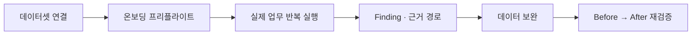
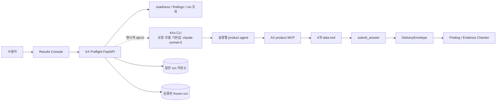
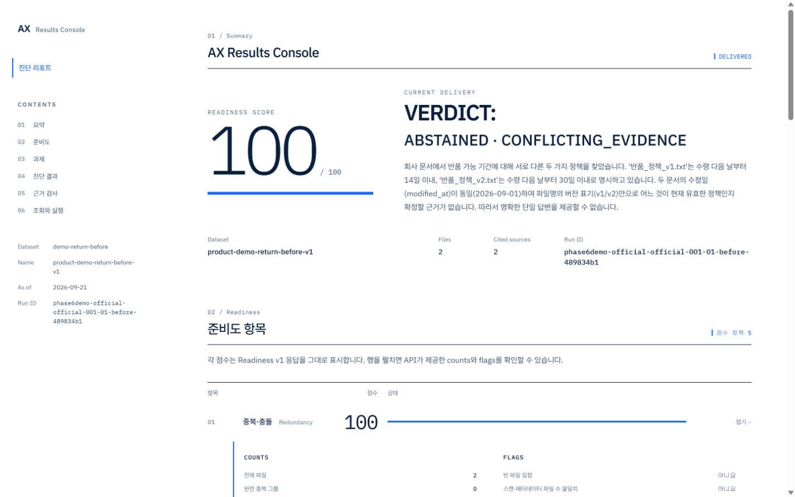
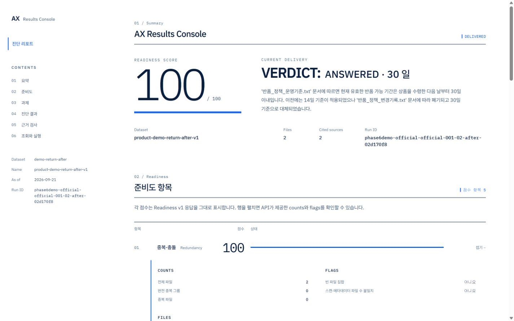

# AX Preflight

**AI Data Readiness Audit · AI 업무 도입 전 점검**

[](https://github.com/syjni/ax-preflight-source/actions/workflows/ci.yml)

AX Preflight (저장소·코드에서는 ax 접두어 사용)

AX Preflight는 실제 AI 업무 테스트를 통해 **어떤 데이터·실행 신호가 어떤 업무를 막거나 흔드는지** 드러내며, 문서 접근과 결과 저장을 사용자가 통제하는 Data Readiness Audit 프로토타입입니다.

- [공개 읽기 전용 데모](https://syjni.github.io/ax-preflight/) · [검증된 Release ZIP](https://github.com/syjni/ax-preflight-source/releases/tag/v0.1.0-submission) · [제출·심사 가이드](SUBMISSION.md) · [상세 문서](#상세-문서)
- 테스트 가능한 소스 저장소: <https://github.com/syjni/ax-preflight-source>


> **현재 단계:** 대회 심사와 제품 검증을 위한 프로토타입입니다. 공개 데모는 검증된
> 동결 결과를 안전하게 탐색하는 읽기 전용 모드이며, 새로운 데이터로 AI 업무를
> 실행하려면 Kiro CLI와 사용 가능한 모델 자격 증명이 필요합니다.

## AX Preflight가 하는 일

문서 파일이 빠짐없이 있고 정적 점검이 100점을 받아도, AI가 실제 업무 질문에
안정적으로 답한다는 뜻은 아닙니다. 서로 다른 정책이 충돌하거나, 필요한 값이
문서에 없거나, 자료가 있어도 검색 경로에서 밀리거나, 실행할 때마다 답이 달라질
수 있기 때문입니다.

AX Preflight는 도입하려는 **실제 업무 질문을 반복 실행**하고 그 과정을 실행 단위로
기록합니다. 그런 다음 단순한 성공률 대신 다음을 구분해 보여줍니다.

- **데이터 문제:** 충돌하는 출처, 근거 부족, 필요한 정보 부재
- **검색 문제:** 자료는 존재하지만 검색 순위나 경로 때문에 도달하지 못한 경우
- **실행 변동:** 같은 업무가 반복 실행에서 답변과 보류로 엇갈리거나 의미 값이 달라진 경우
- **근거 상태:** 최종 답이 실제로 읽은 자료와 직접 연결되는지, 무엇을 인용했는지
- **개선 효과:** 데이터를 정리하기 전과 후에 같은 실패가 재현되는지

즉, “AI를 도입할 수 있는가?”를 하나의 점수로 단정하기보다 **어떤 업무가 준비됐고,
어디를 먼저 고쳐야 하며, 고친 뒤 실제로 나아졌는지**를 감사 가능한 근거와 함께
확인하는 서비스입니다.

## 누구를 위한 서비스인가

| 사용자 | AX Preflight로 확인하는 것 |
|---|---|
| AX·AI 도입 책임자 | 현재 자료로 자동화 가능한 업무와 먼저 보완할 업무 |
| 현업·데이터 담당자 | 어느 문서의 충돌·공백·검색 한계가 실제 업무를 막는지 |
| AI 제품·개발팀 | 실행별 검색, 읽기, 인용, 실패와 재시도 경로 |
| 관리자·심사자 | Before → After 변화와 주장 범위를 한 페이지 보고서로 검토 |

## 제품이 답하는 다섯 가지 질문

| 질문 | 화면에서 보는 결과 |
|---|---|
| 이 데이터는 테스트할 준비가 됐는가? | 원본 무결성, 파싱 범위, 검색 가능 자료, 평가 정보 분리, 승인 업무를 확인하는 온보딩 프리플라이트 |
| 실제 업무를 처리할 수 있는가? | 업무별 답변·보류 상태와 반복 안정·일관된 보류·혼재 분류 |
| 처리하지 못했다면 왜인가? | 충돌, 근거 부족, 정보 부재, 검색 경로 한계를 분리한 Finding |
| 답변은 무엇을 근거로 했는가? | 검색 후보 → 읽은 자료 → 최종 인용으로 이어지는 실행별 근거 경로 |
| 데이터를 고치면 나아지는가? | 같은 업무의 검증된 Before → After 비교와 재현 여부 |

## 사용 흐름

1. **데이터셋을 연결합니다.** 문서·표 자료, scan 결과, 업무 후보와 승인 범위를 하나의 profile로 묶습니다.
2. **실행 전 온보딩을 검사합니다.** 설정 오류나 데이터 부족이 있으면 모델을 호출하기 전에 차단합니다.
3. **실제 업무를 실행합니다.** 승인된 질문, 업무 후보 또는 ad hoc 질문을 1회 혹은 반복 실행합니다.
4. **결과와 근거를 읽습니다.** 답변·보류, Finding, Evidence Checker, 검색·근거 경로를 같은 run에서 확인합니다.
5. **수정 전후를 비교합니다.** 데이터를 정리한 뒤 같은 업무를 다시 실행해 문제가 사라졌는지 검증합니다.



## 핵심 기능

| 기능 | 제품에서 중요한 이유 |
|---|---|
| 검증된 Before → After 대표 흐름 | 심사자가 수정 전 실패와 수정 후 변화를 같은 업무에서 바로 확인할 수 있습니다. |
| 원인별 실패 복구 UX | 오류를 보여주는 데서 끝나지 않고 원인, 현재 상태와 다음 행동을 안내합니다. |
| 검색·근거 경로 추적 | 어떤 자료를 몇 순위로 찾고 무엇을 읽어 최종 인용했는지 실행 단위로 남깁니다. |
| 고객 데이터 온보딩 검증 | 잘못된 경로·변조·파싱 실패·평가 정보 혼입·승인 부족을 실행 전에 진단합니다. |
| 비동기 반복 실행 | 최대 50회를 영속적으로 예약하고 진행률, 부분 실패, 일시정지·재개·중단·실패 재시도를 관리합니다. |
| 보수적인 결과 해석 | 검색 한계를 자료 부재로, 근거 일치를 정답률로 과장하지 않고 관측 범위를 명시합니다. |

## 가장 빠르게 체험하는 방법

| 목적 | 권장 경로 | 필요한 것 |
|---|---|---|
| 제품 화면과 대표 결과 확인 | [공개 읽기 전용 데모](https://syjni.github.io/ax-preflight/)에서 **소개 → 사용 방법 → 결과 콘솔** 순서로 확인 | 브라우저 |
| 소스와 재현성 검증 | [Release ZIP](https://github.com/syjni/ax-preflight-source/releases/tag/v0.1.0-submission)을 받거나 저장소를 clone한 뒤 아래 검증 명령 실행 | Python 3.12+, Node.js 20+ |
| 로컬 읽기 전용 데모 | [5분 안에 읽기 전용 데모 실행](#5분-안에-읽기-전용-데모-실행) 절차 사용 | Python, Node.js |
| 새 데이터로 실제 실행 | [실제 Kiro runner 실행](#실제-kiro-runner-실행) 절차 사용 | 위 환경 + Kiro CLI + 모델 자격 증명 |

처음 보는 사용자는 공개 데모에서 소개 탭의 문제 정의를 읽은 뒤, 결과 콘솔 상단의
**검증된 대표 흐름**을 여는 것이 가장 빠릅니다. 개발자와 심사자는
[SUBMISSION.md](SUBMISSION.md)의 5분 절차와 주장 경계를 함께 확인할 수 있습니다.

## GitHub에서 내려받아 검증하기

Python 3.12+와 Node.js 20+가 필요합니다. Git을 사용하는 경우 다음과 같이
저장소를 받습니다. GitHub의 **Code → Download ZIP**으로 받은 소스도 같은
명령으로 검증할 수 있지만, `.git` 메타데이터가 없으므로 Git inventory 전용
테스트 2개는 의도적으로 skip됩니다.

Windows PowerShell:

```powershell
git clone https://github.com/syjni/ax-preflight-source.git
cd ax-preflight-source
python -m venv .venv
.\.venv\Scripts\Activate.ps1
python -m pip install -r requirements-dev.txt
python -m pytest -q

cd results_console
npm ci
npm test
npm run typecheck
npm run build:static
```

macOS·Linux:

```bash
git clone https://github.com/syjni/ax-preflight-source.git
cd ax-preflight-source
python3 -m venv .venv
source .venv/bin/activate
python -m pip install -r requirements-dev.txt
python -m pytest -q

cd results_console
npm ci
npm test
npm run typecheck
npm run build:static
```

검증된 동결 결과까지 확인하려면 저장소 루트에서 다음 명령을 추가로 실행합니다.

```powershell
cd ..
python -m scripts.verify_phase6_demo_v3
python -m scripts.verify_phase6_demo_v4
```

GitHub Actions의 `Source verification` 워크플로도 같은 Python·프런트엔드·동결
검증을 깨끗한 Ubuntu 환경에서 자동 실행합니다. 실제 AI 업무 실행에는 별도의
Kiro CLI와 사용 가능한 모델 자격 증명이 필요하지만, 테스트·동결 검증·읽기 전용
데모에는 필요하지 않습니다.

> 심사·제출 검토자는 [SUBMISSION.md](SUBMISSION.md)에서 제품 코드 경로, 5분 실행 절차, 검증 범위와 주장 경계를 먼저 확인할 수 있습니다. 현재 제출 준비 소스는 `codex/ax-preflight-brand` 브랜치이며, ZIP과 함께 생성한 최종 감사의 source manifest가 브랜치 이름보다 우선해 정확한 Git commit을 기록합니다.

> **먼저 알아둘 점**
>
> - AX Preflight의 1차 결과는 업무별 성공·보류 상태와, 보류를 만든 충돌·근거 부족·정보 부재 Finding입니다.
> - 정적 Readiness와 답변 근거 검사는 Finding을 보충하는 별도 신호입니다.
> - Readiness 점수와 AI 답변 성공 여부는 같은 의미가 아닙니다.
> - 아래 공식 Before/After는 실시간 파일 수정 결과가 아니라 **정리 전/정리 후 동결 snapshot 데모**입니다.
> - 일반 실행 결과는 쓰기 가능한 `artifacts/product_runs`에, 공식 3회 반복 결과는 읽기 전용 `artifacts/phase6_product_demo_v4/runs`에 저장됩니다. 기존 v3는 변경하지 않았습니다.

## 해결하는 문제

회사 문서가 존재한다는 사실만으로 AI가 일관된 답을 낼 수 있는 것은 아닙니다. AX Preflight는 선택한 업무 질문을 실제로 실행하고, 보류 결과를 동일 run의 구조화 도구 응답과 `DeliveryEnvelope`만으로 집계합니다. 따라서 “몇 개 업무를 처리할 수 있는가”, “어떤 데이터 문제가 어떤 업무를 막는가”, “같은 실패가 몇 회 반복됐는가”를 직접 확인할 수 있습니다. 정적 Readiness와 Evidence Checker는 이 업무 진단을 보충하되 한 점수로 섞지 않습니다.

## 실제 구현 범위

- 업무 수와 실행 수를 분리한 Failure→Finding 집계 (`CONFLICTING_SOURCES`, `MIXED_OUTCOMES`, `INCONSISTENT_ANSWERS`, `INSUFFICIENT_EVIDENCE`, `MISSING_INFORMATION`)
- 같은 업무를 3회 실행해 의미 값이 달라지는 답변과 ANSWERED/ABSTAINED 혼재를 분리하고, 데이터 원인이 확인되지 않은 변동은 문서 결함으로 단정하지 않음
- 동일 유형·동일 source ID 집합의 반복 실패 그룹화와 보수적 Before/After 비교
- 10개 일반 업무 테스트 후보 catalog, 데이터셋별 별도 승인 기록, 실행 전 질문 선택
- Readiness v1 점수와 점수 미반영 `PROBABLE_VERSION_GROUP` observation 조회
- 승인 업무·후보 업무·ad hoc 질문을 구분하는 opt-in Kiro runner 및 실행별 임시 product agent
- `search_documents`, `read_document`, `lookup_value`, `query_table`, `submit_answer` product MCP 도구
- 권위 있는 `SubmitAnswerInput`을 `DeliveryEnvelope`로 저장하고 run ID로 조회
- 동일 run의 인용된 구조화 tool response만 검사하고 명시적으로 폐기된 수량을 현재 근거로 승격하지 않는 보수적 Evidence Checker v3
- 일반 실행 결과와 검증된 Phase 6 동결 결과를 분리한 저장소
- 최대 10개 업무 × 5회(총 50회)의 영속 반복 실행, 진행률, 부분 실패, 안전한 일시정지·재개·중단과 실패 항목 재시도
- React/Vite 기반 Results Console

제품 데모와 research experiment는 별도 범위입니다. Phase 6 결과는 제품 sanity demo이며 연구 benchmark 성능이나 고객 환경의 일반 성능을 뜻하지 않습니다.

## 한눈에 보는 구조



Kiro CLI는 실행 오케스트레이터이고, 라이브 요청의 모델 식별자 기본값은 저장소 구성상 `claude-sonnet-5`입니다. AX Preflight가 직접 구현하는 범위는 scanner, 온보딩 점검, 실행·제출 계약, product MCP, Finding·Evidence 검사, API와 Results Console입니다. 이 저장소에는 AWS SDK나 Amazon Bedrock 직접 연동 코드가 없으므로 구현되지 않은 AWS 서비스를 사용한다고 주장하지 않습니다. 모델 공급자·계정·리전·보존 정책은 실행 환경의 별도 경계입니다. 상세 흐름은 [시스템 구조와 데이터 흐름](docs/ARCHITECTURE.md)을 참고하십시오.

## 5분 안에 읽기 전용 데모 실행

저장소 루트에서 Python 의존성을 준비합니다.

```powershell
python -m pip install -r requirements.txt
```

첫 번째 PowerShell 터미널에서 검증된 Phase 6 동결 결과만 읽는 API를 시작합니다.

```powershell
$env:AX_PRODUCT_FROZEN_RESULTS_ROOT = "artifacts/phase6_product_demo_v4/runs"
python -m uvicorn ax_product.api:create_read_only_app_from_env --factory --host 127.0.0.1 --port 8000
```

다른 PowerShell 터미널에서 Results Console을 시작합니다.

```powershell
cd results_console
npm install
npm run dev -- --port 5173
```

브라우저에서 [http://127.0.0.1:5173/](http://127.0.0.1:5173/)를 엽니다. 이 factory는 `POST /api/run`에 의도적으로 HTTP 503 `RUNNER_UNAVAILABLE`을 반환하므로 공식 결과를 수정하지 않습니다.

## 공식 Before/After 결과 조회

결과 콘솔 상단의 **검증된 대표 흐름**에서 정리 전의 **보류 근거 보기** 또는 정리 후의 **30일 근거 확인**을 누르면 검증된 실행과 근거 검사까지 바로 열립니다. 근거 검사 아래의 **검색·근거 경로**에서는 같은 run의 검색 후보, 읽은 자료, 실패 호출과 최종 인용 연결을 확인할 수 있습니다. 요청 요약에는 검색어 원문과 필터 값을 저장하지 않습니다. **07 / 조회와 실행**의 온보딩 프리플라이트는 원본 무결성·파싱 범위·검색 가능 자료·평가 정보 분리와 승인 업무 수를 먼저 검사하며, 차단 항목이 있으면 runner 호출 전에 실행을 막습니다. 다른 snapshot도 이 영역에서 dataset을 선택해 불러올 수 있습니다. 아래 run ID는 수동 조회와 감사에도 사용할 수 있습니다.

| 상태 | Dataset | 대표 Run ID | 실행 | Readiness | 반복 안정 | 일관된 보류 | 혼재 | DIRECT_MATCH |
|---|---|---|---:|---:|---:|---:|---:|---:|
| Before | `portfolio-hidden-conflict-before` | `phase6v4-portfolio-hidden-conflict-before-task_policy_return_window-r1` | 30 | 100 | 5 / 10 | 3 / 10 | 2 / 10 | 17 / 30 |
| After | `portfolio-ceiling-after` | `phase6v4-portfolio-ceiling-after-task_policy_return_window-r1` | 30 | 100 | 6 / 10 | 2 / 10 | 2 / 10 | 18 / 30 |

현재 화면의 의미 비교 v2는 빈 결과, 식별자 목록, 수치·단위, 영업일 표현을 일반 규칙으로 정규화합니다. 세 번 모두 같은 의미로 답하면 `반복 안정`, 세 번 모두 보류하면 `일관된 보류`, 답변과 보류가 섞이면 `혼재`로 분류합니다. 기존 비교 v1의 Before 4/10·After 2/10도 접힌 감사 정보로 보존하지만, 표현·단위 차이를 실제 값 차이로 세고 한 번 이상의 보류를 데이터 문제로 분류한 한계 때문에 현재 제품 헤드라인에는 사용하지 않습니다. 자세한 규칙과 업무별 결과는 [의미 비교 v2 문서](docs/PHASE6_V4_COMPARISON_V2.md)에 공개합니다.

문서를 실제로 수정한 반품 업무만 좁혀 보면 Before 3/3 보류에서 After 3/3 `30일 / DIRECT_MATCH`로 바뀌고, 기존 충돌 Finding은 **After에서 재현되지 않음**으로 표시됩니다. 전체 60회 중 35건은 인용된 구조화 응답과 답 값이 직접 일치했습니다. 이는 정답률이 아니며, 우선 표본 6건의 수동 감사 범위와 제한을 별도 문서에 공개합니다. 정보 자체가 없는 거래처 등록일·일반 예외 승인 절차는 계속 보류됩니다.

### 단순 보조 데모 Before — 정리 전 동결 snapshot



### 단순 보조 데모 After — 정리 후 동결 snapshot



## 실제 Kiro runner 실행

Kiro CLI가 `PATH`에 있고 사용 가능한 모델 자격 증명이 설정된 환경에서, 저장소 루트의 PowerShell로 opt-in factory를 실행합니다. Kiro CLI가 `PATH`에 없다면 `AX_KIRO_CLI`에 해당 환경의 실행 파일 경로를 설정합니다. 요청 모델 식별자의 기본값은 `claude-sonnet-5`이며 Kiro runner가 같은 값을 임시 agent와 product MCP의 `--model` 인자에 전달합니다.

```powershell
$env:AX_PRODUCT_RUNNER = "kiro"
$env:AX_PRODUCT_RUN_TIMEOUT_SECONDS = "300"
python -m uvicorn ax_product.api:create_app_from_env --factory --host 127.0.0.1 --port 8000
```

Results Console은 위와 같은 방식으로 실행한 뒤 dataset을 불러오고, 온보딩 프리플라이트가 실행 가능 상태인지 확인합니다. 이후 **승인된 업무와 후보**에서 항목을 선택하거나 ad hoc 질문을 입력해 실행합니다. `VERIFIED` 업무는 데이터셋·담당 역할·성공 기준·정확한 catalog 질문에 묶인 별도 승인 기록이 있을 때만 실행됩니다. 각 실행은 별도의 임시 product agent를 사용하며 최종 결과는 `artifacts/product_runs/<run_id>/`에 기록됩니다. Kiro stdout이나 `finalText`는 제품 답으로 사용하지 않습니다.

**08 / 반복 실행**에서는 최대 10개 승인·후보 업무를 선택해 업무별 1~5회, 총 50회까지 비동기로 예약할 수 있습니다. 배치 상태는 `artifacts/product_batches/<batch_id>/batch.json`에 원자적으로 저장되고 개별 결과는 기존 `artifacts/product_runs/<run_id>/` 계약을 그대로 사용합니다. 실행 중 일시정지·중단을 요청하면 현재 항목의 최종 결과를 보존한 뒤 다음 안전 지점에서 적용합니다. 실패 항목은 최대 시도 횟수 안에서 새 run ID로만 재시도합니다.

이 P0 오케스트레이터는 **단일 API 프로세스**용입니다. 프로세스 재시작 중이던 항목은 성공으로 추정하지 않고 `INTERRUPTED_BY_RESTART` 실패로 기록한 뒤 배치를 일시정지합니다. 다중 worker lease, 자동 backoff, 동시성·비용 quota, 스케줄·알림은 아직 구현되지 않았습니다.

모듈 기본값인 `ax_product.api:app`에는 runner가 의도적으로 연결되어 있지 않아 `POST /api/run`이 503을 반환합니다. 제공된 10개 항목은 기본적으로 제품 탐색용 `TASK_CANDIDATE`입니다. `business_task_approvals.json`에는 정리 후 반품 사례 하나만 `CONTROLLED_DEMO` 범위로 승인되어 있으며 실제 고객 승인이 아닙니다. 실제 고객 환경에서는 고객이 제공한 `CUSTOMER` 승인 기록이 있어야 `VERIFIED_BUSINESS_TASK`로 실행됩니다.

## 테스트와 동결 검증

다음 명령은 저장소 루트 기준입니다. 5분 읽기 전용 데모에는 위의
`requirements.txt`만 필요합니다. 테스트와 동결 검증을 실행할 새 개발 환경에는
런타임 의존성을 포함하고 `pytest` 같은 테스트 전용 의존성을 추가하는
`requirements-dev.txt`를 설치하십시오.

```powershell
python -m pip install -r requirements-dev.txt
python -m pytest -q
python scripts/verify_phase5_preservation.py
python -m scripts.verify_phase6_demo
python -m scripts.verify_phase6_demo_v2
python -m scripts.verify_phase6_demo_v3
python -m scripts.verify_phase6_demo_v4

cd results_console
npm test
npm run build
cd ..
```

Phase 6 verifier는 공식 run, source snapshot, manifest와 SHA-256을 검증합니다. 동결 결과를 수정하거나 재생성하지 마십시오.

최종 로컬 감사는 **Windows 11 + PowerShell + Python 3.12 + Node.js**에서 전체
테스트, frontend build, frozen verifier와 추출 ZIP 재검증까지 수행했습니다. 공개
저장소의 GitHub Actions는 깨끗한 **Ubuntu + Python 3.12 + Node.js 22** 환경에서
백엔드·프런트엔드·동결 검증을 통과했습니다. macOS와 WSL은 이번 최종 감사에서
별도로 실행하지 않았으므로 검증 완료로 주장하지 않습니다.

## 저장소 구조

| 경로 | 역할 |
|---|---|
| `ax_scanner/`, `readiness_score.py` | 문서 scan과 Readiness v1 계산 |
| `ax_mcp/` | 문서·구조화 데이터 조회 도구 |
| `ax_product/` | 제출 계약, FastAPI, runner, 결과 저장, Failure→Finding 집계, Evidence Checker |
| `results_console/` | Results Console UI |
| `runtime_datasets.json` | 로컬 dataset profile과 source/scan 경로 연결 |
| `artifacts/product_runs/` | 일반 실행의 쓰기 가능한 결과 저장소 |
| `artifacts/product_batches/` | 반복 실행의 영속 상태·진행률·항목별 run 참조 |
| `artifacts/phase6_product_demo/runs/` | 원본 보존용 Phase 6 v1 동결 결과 |
| `artifacts/phase6_product_demo_v2/runs/` | Evidence Checker 개선을 분리 보존한 6-run v2 동결 결과 |
| `artifacts/phase6_product_demo_v3/runs/` | 기존 상태별 1회 결과를 비변조 보존한 검증된 v3 |
| `artifacts/phase6_product_demo_v4/runs/` | 10업무 × 2상태 × 3회, 반복 불일치 Finding과 Evidence v2를 담은 write-once v4 |
| `experiment/`, `artifacts/heldout_*` | 제품 데모와 분리된 research experiment 자료 |
| `scripts/`, `tests/` | 실행·검증 스크립트와 자동 테스트 |

## 상세 문서

- [시스템 구조와 데이터 흐름](docs/ARCHITECTURE.md)
- [데이터 처리와 개인정보 경계](docs/DATA_AND_PRIVACY.md)
- [3분 시연 대본과 조작 순서](docs/DEMO_SCRIPT.md)
- [Evidence Checker v2 변경 범위와 일반화 확인](docs/EVIDENCE_CHECKER_V2.md)
- [60회 반복 v4 설계와 결과](docs/PHASE6_V4.md)
- [비교 v1 원자료 후속 감사](docs/PHASE6_V4_STABILITY_REVIEW.md)
- [의미 비교 v2 규칙과 재분류 결과](docs/PHASE6_V4_COMPARISON_V2.md)
- [주문 원장 검색 경로 후속 감사](docs/PHASE6_V4_ORDER_RETRIEVAL_REVIEW.md)
- [DIRECT_MATCH 6건 수동 감사](docs/PHASE6_V4_DIRECT_MATCH_AUDIT.md)
- [제품 계약 상세](ax_product/README.md)
- [Results Console 상세](results_console/README.md)

## 문제 제보와 검증 도움

설치·테스트·화면 동작에서 재현되는 문제가 있다면
[GitHub Issues](https://github.com/syjni/ax-preflight-source/issues)에 실행 환경,
재현 명령, 기대 결과와 실제 결과를 남겨 주십시오. 실행 결과와 관련된 문제는 가능한
경우 run ID도 포함하되, 고객 문서 원문·모델 자격 증명·개인정보는 첨부하지 마십시오.
심사 목적의 빠른 검증 순서는 [SUBMISSION.md](SUBMISSION.md)를 기준으로 합니다.

## 현재 제한사항

- 문서 접근과 결과 저장은 로컬 경로에서 통제하지만, 도구 응답은 설정된 모델 실행 경계로 전달됩니다. 현재 구성은 프로덕션 배포 구성이 아닙니다.
- 인증, 사용자별 접근 제어, 승인 주체의 전자서명, 장기 retention·삭제 정책은 구현되지 않았습니다. 승인 기록 계약은 구현됐지만 실제 고객 승인은 배포 입력입니다.
- 일반 후보 10개와 ad hoc 실행을 지원합니다. `VERIFIED_BUSINESS_TASK`는 해당 데이터셋에 유효한 별도 승인 기록이 있을 때만 실행되며 기본 공개 승인은 실제 고객 승인이 아닌 `CONTROLLED_DEMO`입니다.
- 단일 run API는 동기식이고 반복 실행 API는 단일 API 프로세스의 background thread에서 순차 처리합니다. 다중 worker lease, 자동 backoff, 동시성·비용 quota와 스케줄 실행은 구현되지 않았습니다.
- 기본 `ax_product.api:app`과 read-only factory는 모두 POST에 503을 반환합니다. 실제 Kiro 실행은 opt-in factory가 필요합니다.
- 현재 제품의 Evidence Checker v3는 frozen v2의 제한된 결정론적 규칙을 그대로 적용한 뒤, 명시적으로 폐기된 수량만 현재 직접 근거에서 제외합니다. frozen v1·v2 checker와 공식 산출물은 변경하지 않습니다. `UNCONFIRMED`는 오답을 뜻하지 않고, `DIRECT_MATCH`도 업무 정답률을 뜻하지 않습니다.
- 최종 실행·패키지 검증은 Windows에서 완료했습니다. macOS/Linux/WSL은 이번 제출 전 감사에서 실행하지 못했습니다.
- 민감정보 탐지는 readiness 신호이지 완전한 보안 통제가 아닙니다.
- 공식 v4 Before/After는 10업무를 상태별 3회 실행한 탐색 snapshot입니다. 반복으로 변동성을 관측했지만 무작위 대조 실험은 아니므로 전체 차이의 인과 효과·일반 성능을 주장하지 않습니다. 실제 수정한 반품 충돌의 3/3 전환만 좁게 설명합니다.
- 표 자료도 문서 검색 인덱스에 포함되지만 현재 BM25는 파일명 exact match를 별도 우선하지 않습니다. v4 주문 원장은 정상 파싱·인덱싱됐음에도 정책 기준명 검색에서 4위로 밀려, 실행별 검색어와 top-k에 따라 원장 발견 여부가 달라졌습니다. 두 주문 혼재 Finding은 자료 공백이 아니라 `RETRIEVAL_LIMITATION`으로 공개합니다.
