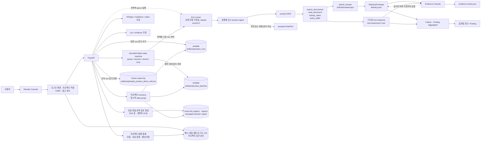

# AX Preflight 시스템 구조와 데이터 흐름

AX Preflight는 업무 실행, Failure→Finding 집계, 문서 준비도 조회, 답 제출, 근거 검사를 서로 다른 계약으로 유지합니다. Results Console은 FastAPI만 호출하고, FastAPI는 조회 요청을 처리하거나 명시적으로 활성화된 경우에만 Kiro runner를 실행합니다.

현재 제출 고정본은
[`v0.5.0-submission`](https://github.com/syjni/ax-preflight-source/releases/tag/v0.5.0-submission)입니다.
reviewer factory와 frozen demo에는 live runner가 없고, opt-in live factory만 아래의 프로젝트
정책·예약·복구 경계를 사용합니다.

## 전체 구조

## 실행 기술과 공급자 경계

Kiro CLI는 opt-in 라이브 실행의 오케스트레이터입니다. `RunRequest.model`과 `.kiro/agents/ax-product.json`의 기본 모델 식별자는 `claude-sonnet-5`이며, runner는 요청된 값을 실행별 임시 agent와 product MCP의 `--model` 인자에 동일하게 전달합니다. product MCP는 네 data tool과 권위 있는 `submit_answer`만 임시 agent에 허용합니다.

AX Preflight 저장소가 직접 구현하는 범위는 scanner, Readiness·온보딩 점검, 실행·제출 계약, product MCP, 저장소, Finding·Evidence 검사, FastAPI와 Results Console입니다. 이 저장소에는 AWS SDK 또는 Amazon Bedrock을 직접 호출하거나 구성하는 코드가 없습니다. 따라서 AWS는 대회 맥락으로만 설명하고, 구현되지 않은 관리형 서비스를 제품 구성요소로 주장하지 않습니다. 실제 모델 공급자, 계정, 리전, 전송·보존 정책은 Kiro와 자격 증명이 구성된 실행 환경에서 별도로 확인해야 합니다.

## 조회 경로

FastAPI는 `runtime_datasets.json`의 profile을 기준으로 dataset을 해석합니다.

로컬 검토와 라이브 factory는 첫 관리자 설정 뒤 모든 고객 데이터 API에 로그인을
요구합니다. 세션은 서버 저장형이며 브라우저 쿠키는 HttpOnly·SameSite=Strict로
설정됩니다. 상태 변경 요청은 별도 CSRF 토큰을 검사합니다. 로컬 dataset은 한
프로젝트에 귀속되고, API는 매 조회·변경마다 구성원 역할을 다시 확인합니다.
실패한 로그인 시도는 digest 식별자로 영속 제한하고, 관리자는 다른 사용자의 세션을
종료할 수 있습니다. 프로젝트 OWNER는 비OWNER 구성원의 접근을 회수하고, 정확한
프로젝트명 확인 뒤 프로젝트별 관리 데이터를 삭제할 수 있습니다. 프로젝트 이벤트는
단조 sequence·SHA-256 연결 해시와 별도 checkpoint로 검증하고 OWNER에게 무결성 상태를 표시합니다. `AX_AUDIT_HMAC_KEY_FILE`에 저장소 밖 키를 설정하면 새 이벤트와 checkpoint를 HMAC으로 인증합니다. 키가 없는 기본 로컬 모드는 외부 불변 기준점이나 WORM 저장소가 아니며 그 한계를 API에 표시합니다. 상태 변경은 state의 audit outbox와 idempotent append로 재조정합니다. 삭제 시 실행 중 작업,
법적 보존과 감사 무결성 오류를 먼저 차단하며, 기존 감사 체인을 다시 쓰지 않고 최소 삭제 tombstone과 opaque 프로젝트 식별자를 유지한 영수증 ID를 반환합니다. 삭제 operation은 별도 원자 JSON에 단계별 완료 상태를 기록해 부분 실패 후 같은 ID로 재개합니다.

- `GET /api/readiness/{dataset}`은 기존 Readiness v1 계산 결과와 별도의 점수 미반영 observation을 반환합니다.
- `GET /api/featured-cases`는 저장된 run과 evidence가 검증된 대표 Before→After 조건을 계속 만족할 때만 Results Console의 대표 흐름을 반환합니다.
- `GET /api/findings/{dataset}`은 저장된 업무 실행을 유형과 source ID 집합으로 보수적으로 그룹화하고 업무 수와 실행 수를 분리해 반환합니다.
- `GET /api/tasks/{dataset}`은 bundled dataset에서는 research benchmark와 분리된 일반 업무 후보 10개를 반환합니다. 로컬 dataset에서는 해당 프로젝트에 등록한 질문·책임 역할·성공 기준을 반환하고, OWNER가 승인한 항목만 `CUSTOMER` 범위 `VERIFIED`로 승격합니다. 기본 공개 승인은 계속 `CONTROLLED_DEMO`입니다.
- `GET /api/runs/{run_id}`은 일반 저장소와 동결 저장소 중 해당 run의 `DeliveryEnvelope`를 반환합니다.
- `GET /api/runs/{run_id}/evidence-check`은 동일한 저장소 origin의 별도 evidence 결과를 반환합니다.
- `GET /api/batches/{batch_id}`는 영속 배치 상태, 진행률과 항목별 run ID·시도·결과를 반환합니다.
- `GET /api/projects/{project_id}/execution-control`은 runner·Kiro CLI 상태, OWNER가 지정한 모델·한도, 선택 dataset의 전달 승인, 최근 24시간 예약 사용량과 실행 차단 사유를 한 응답으로 반환합니다. 모델 자격 증명은 읽거나 저장하지 않고 실행 환경 관리 상태로만 표시합니다.
- `PUT /api/projects/{project_id}/execution-policy`와 `POST/DELETE /api/projects/{project_id}/data-transfer-approval`은 OWNER만 변경할 수 있습니다. 전달 승인은 project·dataset·model·경계 revision에 묶이고 만료 시 무효가 됩니다. revision fingerprint는 정렬된 상대 경로, 원본·마스킹 텍스트 hash, parser 상태와 PII·읽기 실패 신호를 포함하고 표시 이름·점검 시각은 제외합니다. PII 가능 패턴이 있는 자료의 `PUBLIC` 승인은 거절합니다.
- `POST /api/local-datasets/upload`는 브라우저에서 선택한 파일을 localhost의 관리 폴더에 저장하고 정적 scan을 실행합니다. `POST /api/local-datasets`는 `AX_ALLOWED_SCAN_ROOTS`가 설정된 경우에만 resolve된 허용 루트 안의 서버 경로를 복사 없이 읽습니다. 두 경로 모두 모델을 호출하지 않으며 파일 수·개별 크기·전체 크기 한도를 서버에서 적용합니다.
- `GET /api/projects/{project_id}/data-inventory`는 로컬 dataset·관리 사본·구성원·업무·실행 정책·전달 승인·쓰기 가능한 run·batch·PoC 판단을 프로젝트 단위로 반환합니다. `GET /audit-log`는 연결 해시 검증 상태와 최근 이벤트를 OWNER에게 반환하고 `PUT /retention-policy`는 검토 주기·법적 보존을 기록합니다. `POST /purge`는 정확한 프로젝트명 확인과 사전 차단 뒤 run·batch·관리 사본·접근 상태·사후 검증 단계를 영속화합니다. 부분 실패는 500으로 숨기지 않고 operation ID·완료 단계·남은 범주의 영수증을 반환하며, `GET /api/deletions/{operation_id}`로 조회하고 같은 ID로 재개합니다. source 원본과 frozen 결과는 유지합니다.
- `GET /api/projects/{project_id}/poc-evaluation`은 정적 준비도·온보딩·승인 업무·관측 실행·직접 근거·Finding·모델 경계·감사 무결성을 명시적 PASS/WARN/BLOCK 게이트로 집계합니다. OWNER 판단은 평가 fingerprint와 함께 저장되어 입력 지표가 바뀌거나 만료되면 재검토 상태가 됩니다.
- PDF parser는 텍스트와 표를 분리해 추출합니다. 텍스트가 부족한 페이지만 선택적으로 OCR하고, 엔진·언어·페이지·평균 confidence와 미해결 상태를 결과에 기록합니다. OCR 미설치는 전체 점검 실패가 아니라 명시적인 보완 항목입니다.

Failure→Finding 집계, Readiness 계산과 Evidence Checker 판정은 별도입니다. 집계기는 `DeliveryEnvelope`, 영속화된 업무 context와 같은 run의 구조화 응답만 읽고 새 모델 추론을 하지 않습니다. Readiness는 dataset의 scan report를 평가하고, Evidence Checker는 한 실행의 인용 구조화 응답만 평가합니다. 한쪽 결과가 다른 쪽을 수정하거나 대체하지 않습니다.

## 실행 경로

`create_app_from_env`로 opt-in한 경우에만 `POST /api/run`이 Kiro runner에 연결됩니다.

1. FastAPI가 인증 사용자, 프로젝트 접근 권한, 프로젝트 소속 dataset과 승인 업무를 서버에서 다시 확인합니다. 번들 dataset과 frozen 사례는 읽기 전용이며 라이브 실행에는 프로젝트에 등록한 자료가 필요합니다. 승인 업무는 저장된 catalog 질문으로 치환되고 후보·직접 질문은 runner에 전달하지 않습니다.
2. 프로젝트 실행 정책, runner·CLI 상태, dataset·model 전달 승인, 승인 만료, 최근 24시간 실행 수·예상 비용과 동시 실행 한도를 검사합니다. 클라이언트 모델 값보다 서버 승인 모델이 우선하며 불일치 요청은 차단됩니다. 이 검사는 lifecycle lock 안에서 run 예약 직전에 다시 수행됩니다.
3. 검사를 통과하면 run ID, dataset provenance와 선택한 업무 context를 `artifacts/product_runs`에 예약하고, 프로젝트 사용량에 실행당 예상 비용을 `RESERVED`로 예약합니다. pre-run 차단·gate 실패·재시작 중단은 `RELEASED`로 남겨 추적하되 한도에서 제외하고, runner 호출 직전에 `FINALIZED`로 전환해 runner 실패도 사용 시도로 집계합니다. 사용량은 dataset 수명과 분리된 project quota 기록이므로 자료 삭제·재등록으로 초기화되지 않고, 실제 24시간 창이 지나야 집계에서 빠집니다. 사용량 기록 실패 시 아직 시작하지 않은 run 예약을 되돌립니다.
4. Kiro runner가 `.kiro/agents/ax-product.json`을 바탕으로 실행별 임시 product agent를 만듭니다.
5. 임시 agent는 한 product MCP process를 시작하고 네 data tool과 `submit_answer`만 사용합니다.
6. data tool의 성공한 구조화 응답은 같은 run의 `tool-responses/`에 write-once로 저장될 수 있습니다.
7. 첫 번째 유효한 `SubmitAnswerInput`이 권위 있는 제품 결과이며, product MCP가 이를 `DeliveryEnvelope`의 `delivery.json`으로 게시합니다.
8. MCP 종료 후 FastAPI는 파일에 게시된 envelope를 읽습니다. assistant prose, stdout, Kiro `finalText`를 답으로 해석하지 않습니다.
9. Evidence Checker는 승인된 envelope와 그 run의 인용된 구조화 응답을 읽어 `evidence-check.json`을 별도로 게시합니다. 기존 `DeliveryEnvelope`의 `source_link_status`나 내용을 변경하지 않습니다.

### 반복 실행 경로

`POST /api/batches`는 최대 10개 업무, 업무별 1~5회, 총 50회로 제한된 배치를 만든 뒤 요청 스레드와 분리된 단일 worker thread에서 순차 실행합니다.

1. 배치를 저장하기 전에 단일 run과 같은 온보딩 프리플라이트를 검사하고, 모든 승인 업무·후보 질문을 catalog와 대조합니다. 로컬 고객 dataset은 배치 전체 예정 실행 수가 배치·최근 24시간 실행 수·예상 비용 한도 안인지도 검사합니다. 전체가 유효하지 않으면 배치나 run을 예약하지 않습니다.
2. `BatchStore`가 `artifacts/product_batches/<batch_id>/batch.json`을 원자적으로 생성·교체합니다. 집계 수와 진행률은 항목 상태에서 다시 계산됩니다.
3. worker는 항목마다 고유 run ID를 만들고 위의 단일 실행 경로를 호출합니다. 결과 저장·근거 검사·Finding 입력 계약을 별도로 구현하지 않습니다.
4. 일시정지·중단 요청은 현재 runner를 임의로 끊지 않고 그 항목의 최종 결과가 저장된 뒤 적용합니다. 대기 항목만 일시정지하거나 `CANCELLED`로 바꿉니다.
5. 실패 항목 재시도는 최대 시도 횟수 안에서 attempt를 올리고 새 run ID를 사용합니다. 성공 항목과 이전 실패 결과는 덮어쓰지 않습니다.
6. 프로세스 시작 시 활성 상태였던 배치를 검사합니다. `RUNNING` 항목은 `INTERRUPTED_BY_RESTART` 실패로 보수적으로 기록하고 배치를 `PAUSED`로 복구합니다.
7. 재개와 실패 항목 재시도도 현재 정책·전달 승인·잔여 한도를 다시 검사합니다. worker는 배치에 저장된 요청자 identity로 각 항목을 실행하므로 실행 도중 프로젝트 권한이 회수되면 새 항목은 실패로 기록됩니다.

현재 scheduler lock, 동시성 검사와 예상 비용 예약은 단일 API 프로세스 안에서만 원자적입니다. run과 batch에는 이를 소유한 `runtime_instance_id`가 기록됩니다. 단일 프로세스가 다시 시작되면 이전 인스턴스의 실행 중 run은 외부 모델을 자동 재호출하지 않고 `INTERRUPTED_BY_RESTART`로 최종화하며, 실행 중 batch 항목도 같은 코드로 실패 처리한 뒤 명시적 재시도를 기다립니다. 손상된 run 예약 하나는 별도 격리해 나머지 시작 복구를 계속합니다. 같은 writable 저장소를 여러 API 프로세스가 동시에 공유하는 구성은 지원하지 않습니다. 여러 API 프로세스나 분산 worker를 붙이기 전에는 외부 lease/heartbeat, queue, idempotency key, 분산 quota와 자동 backoff가 필요합니다. 실제 모델 토큰·청구액 telemetry는 현재 runner 결과 계약에 없으므로 비용 통제 값은 OWNER가 설정한 실행당 추정치입니다.

## 저장 경계

| 저장소 | 접근 | 내용 |
|---|---|---|
| `artifacts/product_runs` | 일반 실행에서 읽기·쓰기 | run 예약 상태, `delivery.json`, 구조화 tool response, `evidence-check.json` |
| `artifacts/product_batches` | 반복 실행에서 읽기·쓰기 | 배치 제어 상태, 항목별 진행률·시도·run ID·오류 코드 |
| `artifacts/phase6_product_demo_v4/runs` | read-only factory에서 읽기 전용 | 검증·동결된 Phase 6 공식 60-run snapshot |
| `artifacts/local_datasets` 또는 Docker `/data/local-datasets` | 로컬 검토에서 읽기·쓰기 | registry, 마스킹 scan 보고서, 브라우저 선택 파일의 로컬 관리 사본 |
| `<local-datasets>/access_control` | 로컬·라이브 factory에서 읽기·쓰기 | Argon2id 계정, 해시 세션·CSRF·로그인 시도, 프로젝트 구성원·업무 승인, 실행 정책·자료 전달 승인·예상 비용 예약, 보안 이벤트 |

두 root는 겹치거나 중첩될 수 없으며 동일 run ID가 양쪽에 존재하면 구성이 거부됩니다. read-only factory는 시작할 때 `FROZEN_MANIFEST.json` 기반 Phase 6 검증을 수행하고 runner 없이 app을 만들기 때문에 POST가 503이며 동결 결과를 수정하지 않습니다.

Docker reviewer image는 빌드된 Results Console과 local reviewer API를 한 프로세스 주소로
제공하고 Tesseract `kor`·`eng` 언어팩을 포함합니다. `127.0.0.1:8000`에만 publish하며
로컬 점검 데이터는 named volume에 보존합니다. 공개 정적 배포에는 로컬 파일 endpoint가
없고 검증된 예시만 포함됩니다.

## 권위와 비권위 경계

- 권위 있는 제출 입력은 `SubmitAnswerInput`, 권위 있는 저장 결과는 `DeliveryEnvelope`입니다.
- assistant prose와 Kiro `finalText`는 제품 답의 권위 있는 출처가 아니며 evidence 입력도 아닙니다.
- Evidence Checker는 `DeliveryEnvelope`와 같은 run의 구조화 tool response만 입력으로 사용합니다.
- Evidence Checker는 `DeliveryEnvelope`를 수정하지 않습니다.
- Finding의 인용문은 같은 run에 실제 저장된 tool response에서만 가져옵니다.
- Before/After의 “After에서 재현되지 않음”은 After의 해당 업무 실행이 모두 답변된 경우에만 표시합니다.
- Readiness 100은 답변 성공을 보장하지 않고, 답변 성공도 Readiness 점수를 다시 계산하지 않습니다.
