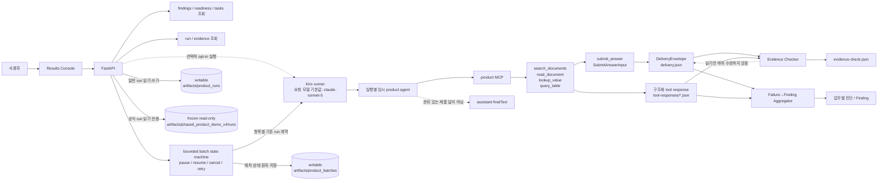

# AX Preflight 시스템 구조와 데이터 흐름

AX Preflight는 업무 실행, Failure→Finding 집계, 문서 준비도 조회, 답 제출, 근거 검사를 서로 다른 계약으로 유지합니다. Results Console은 FastAPI만 호출하고, FastAPI는 조회 요청을 처리하거나 명시적으로 활성화된 경우에만 Kiro runner를 실행합니다.

## 전체 구조

## 실행 기술과 공급자 경계

Kiro CLI는 opt-in 라이브 실행의 오케스트레이터입니다. `RunRequest.model`과 `.kiro/agents/ax-product.json`의 기본 모델 식별자는 `claude-sonnet-5`이며, runner는 요청된 값을 실행별 임시 agent와 product MCP의 `--model` 인자에 동일하게 전달합니다. product MCP는 네 data tool과 권위 있는 `submit_answer`만 임시 agent에 허용합니다.

AX Preflight 저장소가 직접 구현하는 범위는 scanner, Readiness·온보딩 점검, 실행·제출 계약, product MCP, 저장소, Finding·Evidence 검사, FastAPI와 Results Console입니다. 이 저장소에는 AWS SDK 또는 Amazon Bedrock을 직접 호출하거나 구성하는 코드가 없습니다. 따라서 AWS는 대회 맥락으로만 설명하고, 구현되지 않은 관리형 서비스를 제품 구성요소로 주장하지 않습니다. 실제 모델 공급자, 계정, 리전, 전송·보존 정책은 Kiro와 자격 증명이 구성된 실행 환경에서 별도로 확인해야 합니다.

## 조회 경로

FastAPI는 `runtime_datasets.json`의 profile을 기준으로 dataset을 해석합니다.

- `GET /api/readiness/{dataset}`은 기존 Readiness v1 계산 결과와 별도의 점수 미반영 observation을 반환합니다.
- `GET /api/featured-cases`는 저장된 run과 evidence가 검증된 대표 Before→After 조건을 계속 만족할 때만 Results Console의 대표 흐름을 반환합니다.
- `GET /api/findings/{dataset}`은 저장된 업무 실행을 유형과 source ID 집합으로 보수적으로 그룹화하고 업무 수와 실행 수를 분리해 반환합니다.
- `GET /api/tasks/{dataset}`은 research benchmark와 분리된 일반 업무 후보 10개를 반환하고, 별도 승인 registry가 데이터셋·task ID·질문 해시에 유효하게 묶인 항목만 `VERIFIED`로 승격합니다. 기본 공개 승인은 `CONTROLLED_DEMO`이며 실제 고객 승인은 외부 `CUSTOMER` 승인 기록이 필요합니다.
- `GET /api/runs/{run_id}`은 일반 저장소와 동결 저장소 중 해당 run의 `DeliveryEnvelope`를 반환합니다.
- `GET /api/runs/{run_id}/evidence-check`은 동일한 저장소 origin의 별도 evidence 결과를 반환합니다.
- `GET /api/batches/{batch_id}`는 영속 배치 상태, 진행률과 항목별 run ID·시도·결과를 반환합니다.

Failure→Finding 집계, Readiness 계산과 Evidence Checker 판정은 별도입니다. 집계기는 `DeliveryEnvelope`, 영속화된 업무 context와 같은 run의 구조화 응답만 읽고 새 모델 추론을 하지 않습니다. Readiness는 dataset의 scan report를 평가하고, Evidence Checker는 한 실행의 인용 구조화 응답만 평가합니다. 한쪽 결과가 다른 쪽을 수정하거나 대체하지 않습니다.

## 실행 경로

`create_app_from_env`로 opt-in한 경우에만 `POST /api/run`이 Kiro runner에 연결됩니다.

1. FastAPI가 온보딩 프리플라이트를 검사하고, 검증 업무라면 데이터셋별 승인 기록과 정확한 catalog 질문을 확인한 뒤 run ID, dataset provenance와 선택한 업무 context를 `artifacts/product_runs`에 예약합니다.
2. Kiro runner가 `.kiro/agents/ax-product.json`을 바탕으로 실행별 임시 product agent를 만듭니다.
3. 임시 agent는 한 product MCP process를 시작하고 네 data tool과 `submit_answer`만 사용합니다.
4. data tool의 성공한 구조화 응답은 같은 run의 `tool-responses/`에 write-once로 저장될 수 있습니다.
5. 첫 번째 유효한 `SubmitAnswerInput`이 권위 있는 제품 결과이며, product MCP가 이를 `DeliveryEnvelope`의 `delivery.json`으로 게시합니다.
6. MCP 종료 후 FastAPI는 파일에 게시된 envelope를 읽습니다. assistant prose, stdout, Kiro `finalText`를 답으로 해석하지 않습니다.
7. Evidence Checker는 승인된 envelope와 그 run의 인용된 구조화 응답을 읽어 `evidence-check.json`을 별도로 게시합니다. 기존 `DeliveryEnvelope`의 `source_link_status`나 내용을 변경하지 않습니다.

### 반복 실행 경로

`POST /api/batches`는 최대 10개 업무, 업무별 1~5회, 총 50회로 제한된 배치를 만든 뒤 요청 스레드와 분리된 단일 worker thread에서 순차 실행합니다.

1. 배치를 저장하기 전에 단일 run과 같은 온보딩 프리플라이트를 검사하고, 모든 승인 업무·후보 질문을 catalog와 대조합니다. 전체가 유효하지 않으면 배치나 run을 예약하지 않습니다.
2. `BatchStore`가 `artifacts/product_batches/<batch_id>/batch.json`을 원자적으로 생성·교체합니다. 집계 수와 진행률은 항목 상태에서 다시 계산됩니다.
3. worker는 항목마다 고유 run ID를 만들고 위의 단일 실행 경로를 호출합니다. 결과 저장·근거 검사·Finding 입력 계약을 별도로 구현하지 않습니다.
4. 일시정지·중단 요청은 현재 runner를 임의로 끊지 않고 그 항목의 최종 결과가 저장된 뒤 적용합니다. 대기 항목만 일시정지하거나 `CANCELLED`로 바꿉니다.
5. 실패 항목 재시도는 최대 시도 횟수 안에서 attempt를 올리고 새 run ID를 사용합니다. 성공 항목과 이전 실패 결과는 덮어쓰지 않습니다.
6. 프로세스 시작 시 활성 상태였던 배치를 검사합니다. `RUNNING` 항목은 `INTERRUPTED_BY_RESTART` 실패로 보수적으로 기록하고 배치를 `PAUSED`로 복구합니다.

현재 scheduler lock과 worker 소유권은 단일 API 프로세스 안에서만 유효합니다. 여러 API 프로세스나 분산 worker를 붙이기 전에는 외부 lease/queue, idempotency key, 동시성·비용 quota와 자동 backoff가 필요합니다.

## 저장 경계

| 저장소 | 접근 | 내용 |
|---|---|---|
| `artifacts/product_runs` | 일반 실행에서 읽기·쓰기 | run 예약 상태, `delivery.json`, 구조화 tool response, `evidence-check.json` |
| `artifacts/product_batches` | 반복 실행에서 읽기·쓰기 | 배치 제어 상태, 항목별 진행률·시도·run ID·오류 코드 |
| `artifacts/phase6_product_demo_v4/runs` | read-only factory에서 읽기 전용 | 검증·동결된 Phase 6 공식 60-run snapshot |

두 root는 겹치거나 중첩될 수 없으며 동일 run ID가 양쪽에 존재하면 구성이 거부됩니다. read-only factory는 시작할 때 `FROZEN_MANIFEST.json` 기반 Phase 6 검증을 수행하고 runner 없이 app을 만들기 때문에 POST가 503이며 동결 결과를 수정하지 않습니다.

## 권위와 비권위 경계

- 권위 있는 제출 입력은 `SubmitAnswerInput`, 권위 있는 저장 결과는 `DeliveryEnvelope`입니다.
- assistant prose와 Kiro `finalText`는 제품 답의 권위 있는 출처가 아니며 evidence 입력도 아닙니다.
- Evidence Checker는 `DeliveryEnvelope`와 같은 run의 구조화 tool response만 입력으로 사용합니다.
- Evidence Checker는 `DeliveryEnvelope`를 수정하지 않습니다.
- Finding의 인용문은 같은 run에 실제 저장된 tool response에서만 가져옵니다.
- Before/After의 “After에서 재현되지 않음”은 After의 해당 업무 실행이 모두 답변된 경우에만 표시합니다.
- Readiness 100은 답변 성공을 보장하지 않고, 답변 성공도 Readiness 점수를 다시 계산하지 않습니다.
